<h1>Setup the fully kubernetes cluster inside the locally hosted</h1>

<h2>Table of Contents</h2>

- [Use `Vargrant` to configuration the VM with provider](#use-vargrant-to-configuration-the-vm-with-provider)
  - [Requirements tools](#requirements-tools)
  - [Step by step](#step-by-step)
  - [`Vargrant` note](#vargrant-note)
- [Ansible - To setup and run script and bring up kubernetes cluster on locally, Use `kind`](#ansible---to-setup-and-run-script-and-bring-up-kubernetes-cluster-on-locally-use-kind)
  - [Define host for ansible provisioning](#define-host-for-ansible-provisioning)
  - [Run ansible for provisioning k8s with kind](#run-ansible-for-provisioning-k8s-with-kind)
  - [Conclusion after provisioning K8s with kind and connfiguration](#conclusion-after-provisioning-k8s-with-kind-and-connfiguration)
- [Exploring, understanding and provisioning require components inside the `kind` cluster](#exploring-understanding-and-provisioning-require-components-inside-the-kind-cluster)
  - [Make the cluster become to ready state](#make-the-cluster-become-to-ready-state)
  - [Learn about `kind` cluster](#learn-about-kind-cluster)
  - [Detailing the important components inside the `kind` cluster](#detailing-the-important-components-inside-the-kind-cluster)
- [`cilium` and `ebpf` - The powerful kernal service of kubewekend cluster](#cilium-and-ebpf---the-powerful-kernal-service-of-kubewekend-cluster)
  - [Do familiar with `ebpf` and `cilium`](#do-familiar-with-ebpf-and-cilium)
  - [Enable `hubble` in cluster to see what network work inside the kubewekend cluster](#enable-hubble-in-cluster-to-see-what-network-work-inside-the-kubewekend-cluster)
- [Build and Operate High Availability (HA) `Kubewekend` Cluster](#build-and-operate-high-availability-ha-kubewekend-cluster)
  - [Dive deeper into Kubelet](#dive-deeper-into-kubelet)
  - [Dynamic add nodes to kind cluster](#dynamic-add-nodes-to-kind-cluster)
    - [Not mount `kernel` to worker node](#not-mount-kernel-to-worker-node)
    - [Can't not install `cilium CNI` inside worker node](#cant-not-install-cilium-cni-inside-worker-node)
  - [Use `vmbox` to join worker node into master node](#use-vmbox-to-join-worker-node-into-master-node)
    - [Attach your machine with `Nat Network`](#attach-your-machine-with-nat-network)
    - [Do some step with configuration `cgroup`](#do-some-step-with-configuration-cgroup)
    - [Connect your worker to master via `kubeadm`](#connect-your-worker-to-master-via-kubeadm)

## Use `Vargrant` to configuration the VM with provider

Read full article about session at [Kubewekend Session 1: Build up your host with Vagrant](https://wiki.xeusnguyen.xyz/Tech-Second-Brain/Personal/Kubewekend/Kubewekend-Session-1)

### Requirements tools

  - Install [virtualbox](https://www.virtualbox.org/wiki/Downloads)
  - Install [vagrant](https://developer.hashicorp.com/vagrant/docs/installation)

### Step by step

1. Location on the root of project
2. Set environment from file `.env` or manually configure

```bash
# Manually
export SSH_USER="vargrant-user"
export SSH_PRIV_KEY_PATH="~/.ssh/vmbox"

# Use .env file
cp -r .env.examples .env
set -o allexport && source .env && set +o allexport
```
3. Up your `vagrant` via `virtualbox` by

```bash
# Use can use another provider: https://developer.hashicorp.com/vagrant/docs/providers
# Provision 1 master and 1 worker
vagrant up k8s-master-machine k8s-worker-machine-1 --provider=virtualbox

# You can provision more worker with regex pattern
vagrant up "/k8s-worker-machine-[2-3]/" --provider=virtualbox
```

<h3>Result provisioning</h3>


### `Vargrant` note

> When you want to destroy, use `destroy` command with option to destroy vm

```bash
# Shutdown and destroy VM for all machines
vagrant destroy --graceful --force

# Specify the target with name
# (Use can regex to manipulate multiple machines)
vagrant destroy k8s-worker-machine-1 --graceful --force
```

> When you want to execute a `shell` script, you can use `provision` command

```bash
# Execute a shell script for all machines
vagrant provision

# Execute a shell script for specific machines
# (Use can regex to manipulate multiple machines)
vagrant provision k8s-worker-machine-1
```

> When you want to turn off the machine provisioning, use `halt` command

```bash
# Turn off all machines provision
vagrant halt

# Turn off the specific machine provision 
# (Use can regex to manipulate multiple machines)
vagrant halt k8s-worker-machine-1
```

> When you want to reload the machine provisioning when update Vargrantfile, use `reload` command

```bash
# Reload all machines provision
vagrant reload

# Reload the specific machine provision
# (Use can regex to manipulate multiple machines)
vagrant reload k8s-worker-machine-1
``` 

> When you want to add a new box to the machine, or cut off time for downloads machine. Use can use `box` command

```bash
# Check actually box we have in host
vagrant box list

# Install box to host
vagrant box add https://location/of/vagrant/box # (Can be local, Vagrant Registry or private storage)

# Example: vagrant box add https://app.vagrantup.com/ubuntu/boxes/focal64
```

When you want to connect to the machine, you have two ways to connect 

- Via `vargrant`, `ssh` command

```bash
# Connect to machine with specified machine name
vagrant ssh k8s-worker-machine-1

# When you want to pass command via ssh
vagrant ssh k8s-worker-machine-1 --command "echo "Hello World" > foo.txt"
```

- Via actions with manually configured `ssh-key`

```bash
# With this action you need to location where .vagrant in your project, usually in root directory
ls .vagrant/

# After that you need run `ssh-agent` to create new session for agent ssh
eval $(ssh-agent -s) # Set the new session agent

# Add the key to your host, and make a authentication
ssh-add ./vagrant/machines/k8s-master-machine/private_key

# And lastone make a connection to machine on custom port
# Befor that you can check again with `vagrant ssh-config` to understand your `ssh` work on port
vagrant ssh-config

# Make a ssh connection
ssh vagrant@127.0.0.1 -p 6996
```

<h3>Show SSH Configuration</h3>


<h3>Make SSH connection</h3>


## Ansible - To setup and run script and bring up kubernetes cluster on locally, Use `kind`

Read full article about session at [Kubewekend Session 2: Setup Kind cluster with Ansible](https://wiki.xeusnguyen.xyz/Tech-Second-Brain/Personal/Kubewekend/Kubewekend-Session-2)

### Define host for ansible provisioning

On this step, you can use script which i create for purpose read and update hosts file for ansible

```bash
# If the file not executable, you can update permission for that
chmod +x ./script/operate-kind-cluster.kind

# Execute the bash script
./script/operate-kind-cluster.sh
```

After that your hosts file will update, like

```yaml
k8s-master-machine ansible_ssh_host=127.0.0.1 ansible_ssh_port=6996 ansible_ssh_user=vagrant
k8s-worker-machine-1 ansible_ssh_host=127.0.0.1 ansible_ssh_port=9669 ansible_ssh_user=vagrant
```

When you doing done with setup hosts, you can use `ansible` to check your connection to host

```bash
ansible -i ./ansible/inventories/hosts all --user=vagrant -m ping
```

<h3>Check ping with Ansible</h3>


### Run ansible for provisioning k8s with kind

Before you doing this step, you need make sure

- Need to configure Ansible to run the project (Ansible runs only on Linux, so need WSL for window machine or Linux virtual machine)
- Ansible is a bunch of tools built from python3. Install python is obligated for setup ansible environment (Recommended: python_version >= 3.9). Installing ansible ansible-lint via command:

```bash
# Python < 3.12
pip3 install ansible ansible-lint

# With Python = 3.12 (That tough to install :>)
# NOTICE: You need follow the strategy of python
# Recommendation: install apt
sudo apt install python3-ansible-runner -y
# Use pipx instead pip3 to install non-debian package
sudo apt install pipx -y
pipx ensurepath
pipx install ansible-lint
```

After you install all things above, just feel free to update or change configuration inside `./ansible/inventories/host_vars` to update configuration on `master` or `worker`, and one more things ansible will use `template` to configuration `kind`, and you can follow that config and know what variable will map to `template` at `./ansible/templates/kind-config.yaml.j2`

When you confirm all, perform command `ansible-playbook` to help you build kind cluster inside machine. Ansible will include two tags

- **install_common**: Install dependencies and install kind tool, to help you setup kind cluster
- **setup_kind**: Set variables base on your host_name, and execution `kind` command to build cluster base on template

```bash
# Setup control-plane (master) machine
ansible-playbook -i ansible/inventories/hosts --extra-vars="host_name=k8s-master-machine" --tags "install_common,setup_kind" ansible/k8s-provisioning-playbook.yaml
# Setup worker machine
ansible-playbook -i ansible/inventories/hosts --extra-vars="host_name=k8s-worker-machine-1" --tags "install_common,setup_kind" ansible/k8s-provisioning-playbook.yaml
```

<h3>Control Plane when completely provisioning</h3>


<h3>Worker when completely provisioning</h3>


### Conclusion after provisioning K8s with kind and connfiguration

> On this session, you will have meet the problem about `kind` need control-plane to operate cluster, It means you need at least one cluster to doing control stuff, not only worker node on host. So that cause some misconfiguration, to prevent fail in `ansible`, so I custom the template except `role` variables, now it will do same provisioning for master and worker, just exist only `control-plane` role

Actually when you install `kubectl` to your host, you will figure out 

>[!Bug]
Right now, you kind cluster be in provisioned, **but your state of cluster will not be ready**, it means because some target is not be ready, include `local-path-provisioner` `core-dns`. And reason why start from we do not install `cni` and it make kubelet cann't be started inside the cluster, 

*That is reason why temporarily I will not share about how can make cluster become HA. And replacing, now we are moving to next part to learn about `etcd`, `cni` and `kubelet`, that can make your cluster become professional and stable*

## Exploring, understanding and provisioning require components inside the `kind` cluster

Read full article about session at [Kubewekend Session 3: Basically about Kubernetes architecture](https://wiki.xeusnguyen.xyz/Tech-Second-Brain/Personal/Kubewekend/Kubewekend-Session-3)

### Make the cluster become to ready state

> IYKYK, on the previous session 2, we have problem about state of cluster is not `ready`, you can deal with that problem by easily install one of `cni` to the cluster. In this topic, I will learn `cilium` and go to advantage with this tool that reason why i choose `cilium` to default `cni` of the cluster

You can find more information about setup `cilium` at: [Cilium Quick Installation](https://docs.cilium.io/en/stable/gettingstarted/k8s-install-default/)

To operate `cilium`, you need to install `cli` version and get communication with your cluster via that daemon

```bash
# Download cilium
wget https://github.com/cilium/cilium-cli/releases/download/v0.16.11/cilium-linux-amd64.tar.gz

# Extract
tar -xzf cilium-linux-amd64.tar.gz

# Install cilium
sudo mv cilium /usr/local/bin/
```

And now you have `cilium-cli` on your host


You install `cilium` to your cluster

```bash
# Install cilium to your cluster
cilium install --version 1.15.6

# Validate of cilium after installation
cilium status --wait
```


And re-check again your state of node, all pods and node are ready for in-use, before to doing that check make sure you install `kubectl`.

```bash
# Install kubectl from official page
curl -LO "https://dl.k8s.io/release/$(curl -L -s https://dl.k8s.io/release/stable.txt)/bin/linux/amd64/kubectl"

# Change permission for your kubectl tool
chmod +x kubectl

# Install kubectl to your host
sudo mv kubectl /usr/local/bin
```


You can check and validate your state of cluster and pod via `get` command

```bash
kubectl get pods -A
```


```bash
kubectl get nodes
```


Already for all stuff, now we can inspect what we have after running successfully cluster with `kind`

### Learn about `kind` cluster

When you work with Kubernetes this will contain some major features, and you need to understand. Read more at: [Kubernetes Components](https://kubernetes.io/docs/concepts/overview/components/) for English Version and If you want to learn in Vietnamese, shout out to [A. Quan Huynh - Kubernetes Series - Kubernetes internals architecture](https://viblo.asia/p/kubernetes-series-bai-11-kubernetes-internals-architecture-L4x5xPjb5BM)

Belong to `control-plane`
- `kube-apiserver`: *The API server is a component of the Kubernetes control plane that exposes the Kubernetes API.*
- `etcd`: *Consistent and highly-available key value store used as Kubernetes' backing store for all cluster data.*
- `kube-controller`: *Control plane component that runs controller processes.*
- `kube-scheduler`: *Control plane component that watches for newly created Pods with no assigned node, and selects a node for them to run on.*

Belong to `node`
- `kube-proxy`: *kube-proxy is a network proxy that runs on each node in your cluster, implementing part of the Kubernetes Service concept.*
- `kubelet`: *An agent that runs on each node in the cluster. It makes sure that containers are running in a Pod.*
- `Container runtime`: *Easily from previous twice session, kind use `docker` to part of container engine to operate cluster*.

Besides

> With kind, mostly of them is providing

- I have customize additional about networking part with `cilium` (Network Plugins) - *software components that implement the container network interface (CNI) specification*. That is factor and build up your workflow in local node on next session in my series
- `Container Resource Monitoring`: *Container Resource Monitoring records generic time-series metrics about containers in a central database, and provides a UI for browsing that data (Now, I am not setup this, but on the monitoring session)*
- `Cluster-level Logging`: *A cluster-level logging mechanism is responsible for saving container logs to a central log store with search/browsing interface.*
- `DNS`: *Cluster DNS is a DNS server, in addition to the other DNS server(s) in your environment, which serves DNS records for Kubernetes services.*

### Detailing the important components inside the `kind` cluster

1. So first read about `kubelet` configuration inside host, you need to exec inside `kind-control-plane` container

```bash
# Exec to docker control-plane
docker exec -it k8s-master-machine-control-plane /bin/bash

# View kubelet configuration
kubectl get --raw "/api/v1/nodes/k8s-master-machine-control-plane/proxy/configz" | jq
```
and you can view about `kubelet` configuration

2. Secondly, we will move to  `etcd` of kind cluster, that is important factor in kubernetes help you mostly powerful thing

You can find more information about `etcd` in the documentation: https://etcd.io/docs/v3.5/, and figure out what `etcd` bring up to kubernetes at: https://www.armosec.io/glossary/etcd-kubernetes/

- To view about detail `etcd`, use can use `get` command

```bash
kubectl get pods etcd-k8s-master-machine-control-plane -o json
```

And currently on `1.28.9` kubernetes, `etcd` is already running on version `registry.k8s.io/etcd:3.5.12-0`


- You can access to `etcd` shell, and can perform some practice with that use `exec` command

```bash
# Exec to stdin
kubectl exec --tty --stdin pods/etcd-k8s-master-machine-control-plane -- /bin/sh

# Use etcd to check version
etcd --version

# Practice etcd via etcdctl
etcdctl version
```

3. We will move on `kube-scheduler` which give decisions about what node is can deploy your pod, inspect that via `describe` command

```bash
# Inspect about kube-scheduler
kubectl describe pods/kube-scheduler-k8s-master-machine-control-plane
```

As you can see, It will run container in image `registry.k8s.io/kube-scheduler:v1.28.9`, and provide some configuration like

```bash
kube-scheduler
--authentication-kubeconfig=/etc/kubernetes/scheduler.conf
--authorization-kubeconfig=/etc/kubernetes/scheduler.conf
--bind-address=127.0.0.1
--kubeconfig=/etc/kubernetes/scheduler.conf
--leader-elect=true
```

You can explore more about at: [Scheduler Configuration](https://kubernetes.io/docs/reference/scheduling/config/)

Follow the [Linkedin - Demystifying the Kubernetes Scheduler: Assigning Pods to Nodes Behind the Scenes](https://www.linkedin.com/pulse/demystifying-kubernetes-scheduler-assigning-pods-nodes-adamson-y9eie#:~:text=The%20default%20scheduler%20algorithm%20filters,resource%20utilization%2Cspreading%2C%20etc.), and I can understand argorithm mostly use like

> The default scheduler algorithm filters and prioritizes nodes to find optimal match. 

- **Filtering** rules out nodes that don't meet pod requirements like enough resources or match affinity rules.

- **Prioritizing** ranks remaining nodes to pick the best fit based on factors like resource utilization,spreading, etc.

4. Yup the `kube-controller`, kind have it and you can inspect more inside kind cluster use `describe` command, you can explore about this component at: https://komodor.com/learn/controller-manager/

```bash
kubectl describe pods/kube-controller-manager-k8s-master-machine-control-plane
```

I know it just controller base on kubernetes version `registry.k8s.io/kube-controller-manager:v1.28.9` with parameters

```bash
 kube-controller-manager
   --allocate-node-cidrs=true
   --authentication-kubeconfig=/etc/kubernetes/controller-manager.conf
   --authorization-kubeconfig=/etc/kubernetes/controller-manager.conf
   --bind-address=127.0.0.1
   --client-ca-file=/etc/kubernetes/pki/ca.crt
   --cluster-cidr=10.244.0.0/16
   --cluster-name=k8s-master-machine
   --cluster-signing-cert-file=/etc/kubernetes/pki/ca.crt
   --cluster-signing-key-file=/etc/kubernetes/pki/ca.key
   --controllers=*,bootstrapsigner,tokencleaner
   --enable-hostpath-provisioner=true
   --kubeconfig=/etc/kubernetes/controller-manager.conf
   --leader-elect=true
   --requestheader-client-ca-file=/etc/kubernetes/pki/front-proxy-ca.crt
   --root-ca-file=/etc/kubernetes/pki/ca.crt
   --service-account-private-key-file=/etc/kubernetes/pki/sa.key
   --service-cluster-ip-range=10.96.0.0/16
   --use-service-account-credentials=true
```

5. How about `apiserver`, that is important plane for make conversation for all cluster, handle all request and execute when you meet the requirements

More explore about `apiserver` will disscuss details in this session in my blog, but you can feel free to inspect configuration and service use `kubectl`

```bash
# Inspect information about apiserver
kubectl describe pods/kube-apiserver-k8s-master-machine-control-plane
```

Like above, It use same version of kubernetes, `registry.k8s.io/kube-apiserver:v1.28.9`, with configuration

```bash
 kube-apiserver
   --advertise-address=172.18.0.2
   --allow-privileged=true
   --authorization-mode=Node,RBAC
   --client-ca-file=/etc/kubernetes/pki/ca.crt
   --enable-admission-plugins=NodeRestriction
   --enable-bootstrap-token-auth=true
   --etcd-cafile=/etc/kubernetes/pki/etcd/ca.crt
   --etcd-certfile=/etc/kubernetes/pki/apiserver-etcd-client.crt
   --etcd-keyfile=/etc/kubernetes/pki/apiserver-etcd-client.key
   --etcd-servers=https://127.0.0.1:2379
   --kubelet-client-certificate=/etc/kubernetes/pki/apiserver-kubelet-client.crt
   --kubelet-client-key=/etc/kubernetes/pki/apiserver-kubelet-client.key
   --kubelet-preferred-address-types=InternalIP,ExternalIP,Hostname
   --proxy-client-cert-file=/etc/kubernetes/pki/front-proxy-client.crt
   --proxy-client-key-file=/etc/kubernetes/pki/front-proxy-client.key
   --requestheader-allowed-names=front-proxy-client
   --requestheader-client-ca-file=/etc/kubernetes/pki/front-proxy-ca.crt
   --requestheader-extra-headers-prefix=X-Remote-Extra-
   --requestheader-group-headers=X-Remote-Group
   --requestheader-username-headers=X-Remote-User
   --runtime-config=
   --secure-port=6443
   --service-account-issuer=https://kubernetes.default.svc.cluster.local
   --service-account-key-file=/etc/kubernetes/pki/sa.pub
   --service-account-signing-key-file=/etc/kubernetes/pki/sa.key
   --service-cluster-ip-range=10.96.0.0/16
   --tls-cert-file=/etc/kubernetes/pki/apiserver.crt
   --tls-private-key-file=/etc/kubernetes/pki/apiserver.key
```

6. Go to `kube-proxy`, network configuration implementation for kubernetes concept, To inspect that service use `describe` command

```bash
kubectl describe pods/kube-proxy-xxxxx
```

NOTE: `xxxxx` will need you to fill, use `get pods` to retrieve that

After you use `describe` command, you can image the container it use `registry.k8s.io/kube-proxy:v1.28.9` and use configmap to add configuration to kube-proxy

```bash
kubectl get configmap kube-proxy
```

7. Reach to lastly `coredns`, that is `dns` service which offer from `kubernetes`, mostly use for `dns` and `service discovery` purpose

```bash
kubectl describe deployments coredns 
```

As you can see, `coredns` will use configuration from `configmap` to operate and start with image `registry.k8s.io/coredns/coredns:v1.10.1`, that will help your service understand, give dns inside cluster to give route for service can commnuncate with each others

The config is quite new for me, but that kind of clearly to understanding what that want to defination

```bash
  Corefile: |
    .:53 {  Corefile: |
    .:53 {
        errors
        health {
           lameduck 5s
        }
        ready
        kubernetes cluster.local in-addr.arpa ip6.arpa {
           pods insecure
           fallthrough in-addr.arpa ip6.arpa
           ttl 30
        }
        prometheus :9153
        forward . /etc/resolv.conf {
           max_concurrent 1000
        }
        cache 30
        loop
        reload
        loadbalance
    }

        errors
        health {
           lameduck 5s
        }
        ready
        kubernetes cluster.local in-addr.arpa ip6.arpa {
           pods insecure
           fallthrough in-addr.arpa ip6.arpa
           ttl 30
        }
        prometheus :9153
        forward . /etc/resolv.conf {
           max_concurrent 1000
        }
        cache 30
        loop
        reload
        loadbalance
    }
```

And now we go through all the services of the cluster, reach to especially things I have setup, to understand what is that `cilium` service and what we can use it for

## `cilium` and `ebpf` - The powerful kernal service of kubewekend cluster

Read full article about session at [Kubewekend Session 4: Learn about ebpf with hubble and cilium](https://wiki.xeusnguyen.xyz/Tech-Second-Brain/Personal/Kubewekend/Kubewekend-Session-4)

### Do familiar with `ebpf` and `cilium`

So on the previous session, we do installation `cilium` to the kubewekend cluster, if use `status` command, you can known about status of cilium kubewekend cluster, including

- `cilium-operator`
- `cilium` in deamonset

If you have those one in `kubernetes`, you can practice around the command `cilium` to understand what `cilium` can do for

- You can use `--help` flag with `cilium-cli` to see more information

```bash
vagrant@k8s-master-machine:~$ cilium --help
CLI to install, manage, & troubleshooting Cilium clusters running Kubernetes.

Cilium is a CNI for Kubernetes to provide secure network connectivity and
load-balancing with excellent visibility using eBPF

Examples:
# Install Cilium in current Kubernetes context
cilium install

# Check status of Cilium
cilium status

# Enable the Hubble observability layer
cilium hubble enable

# Perform a connectivity test
cilium connectivity test

Usage:
  cilium [flags]
  cilium [command]

Available Commands:
  bgp          Access to BGP control plane
  clustermesh  Multi Cluster Management
  completion   Generate the autocompletion script for the specified shell
  config       Manage Configuration
  connectivity Connectivity troubleshooting
  context      Display the configuration context
  encryption   Cilium encryption
  help         Help about any command
  hubble       Hubble observability
  install      Install Cilium in a Kubernetes cluster using Helm
  status       Display status
  sysdump      Collects information required to troubleshoot issues with Cilium and Hubble
  uninstall    Uninstall Cilium using Helm
  upgrade      Upgrade a Cilium installation a Kubernetes cluster using Helm
  version      Display detailed version information

Flags:
      --context string             Kubernetes configuration context
      --helm-release-name string   Helm release name (default "cilium")
  -h, --help                       help for cilium
  -n, --namespace string           Namespace Cilium is running in (default "kube-system")

Use "cilium [command] --help" for more information about a command.
```

- To setup completion with `cilium` in your shell, use `completion` and command into your shell profile, such as `zsh` or `bash`

```bash
# Use if your profile is bash
echo "source <(cilium completion bash) >> .bashrc"

# Use if your profile is zsh
echo "source <(cilium completion zsh) >> .zshrc"
```

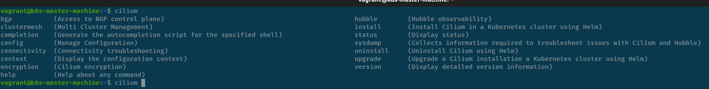

- You can check about `cilium` connectivity access in kubewekend cluster with providing scenarios from `cilium` via `connectivity test`
 
```bash
# If you validate connectivity

## Read manual of connectivity test command
cilium connectivity test --help

## Run tests inside cluster
cilium connectivity test

# If you want ti check network performance

## Read manual of connectivity perf command
cilium connectivity perf --help

## Run tests for check network performance
cilium connectivity perf
```


You will have `82` tests scenarios in kubewekend cluster, afterward you will get the result, if not any failure, your `cilium` work great with cluster

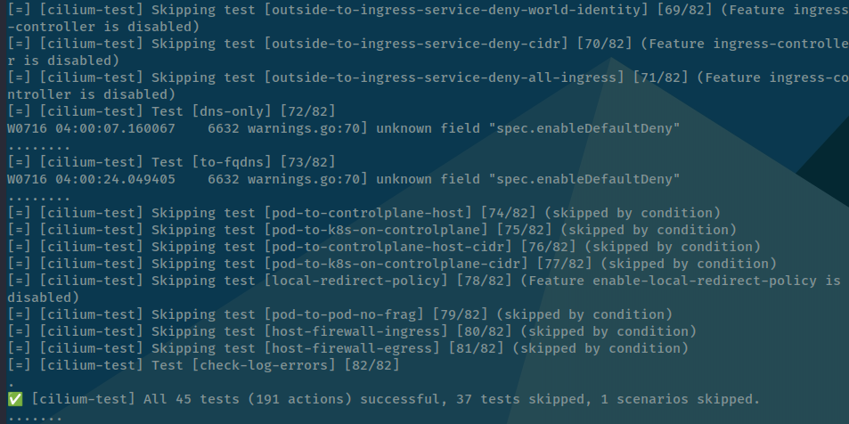

Fun things if you want to check about `echo-same-node` deployment, you can play with `port-forward` command inside `kubectl` and use reverse `ssh` to check the web-service before we setup `cilium` to expose service via domain

```bash
# Expose your service via localhost
kubectl port-forward -n cilium-test service/echo-same-node 8080:8080

# Because we do not hand-on any network inside `vmbox`, so we will use another way expose this service to your via `ssh-tunneling`
# Documentation: https://www.ssh.com/academy/ssh/tunneling-example

ssh -N -L 8080:127.0.0.1:8080 -i .vagrant/machines/k8s-master-machine/virtualbox/private_key vagrant@127.0.0.1 -p 6996
```

Access your host at `http://localhost:8080`

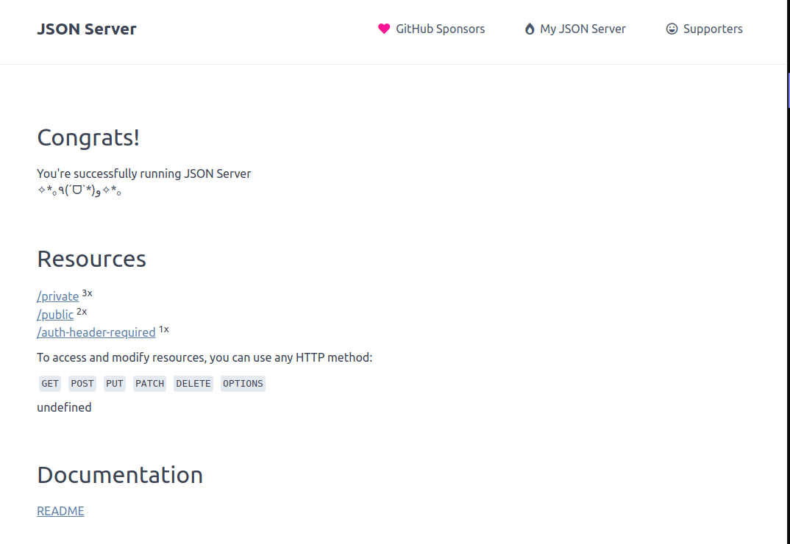

> Quite fun a little bit, move on to inside `cilium` and inspect what is going on inside, view all the commands to use inside agent at https://docs.cilium.io/en/latest/cheatsheet/

```bash
# Find out the cilium pod
kubectl get pods -n kube-system

# Exec to the cilium pod to inspect more extensions
kubectl exec --tty --stdin -n kube-system cilium-xxxxx -- /bin/bash
```

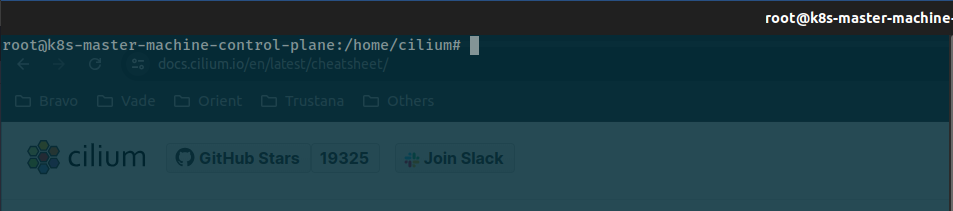

- First of all, you run `status` command to deep inspect about the agent

```bash
# Check basic status
cilium status

# Check more about information on all controllers, health and redirects
cilium status --all-controllers --all-health --all-redirects
```

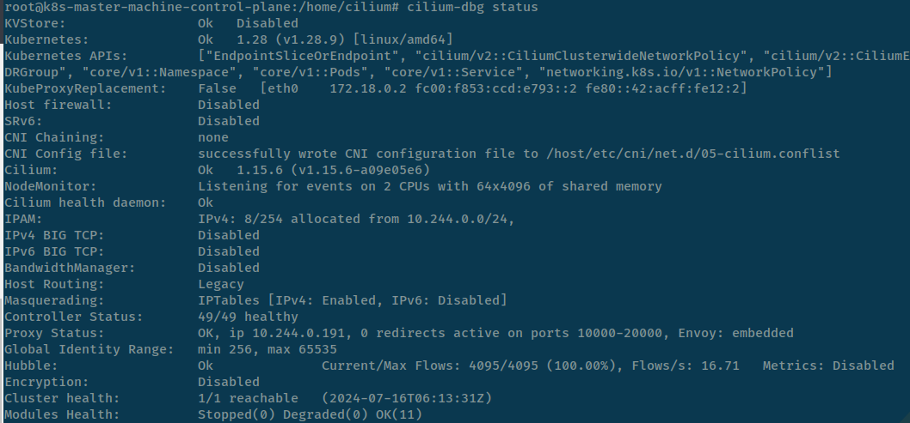

- Get current agent configuration

```bash
# Check configuration in basic
cilium config

# View all configuration of agent
cilium config --all
```

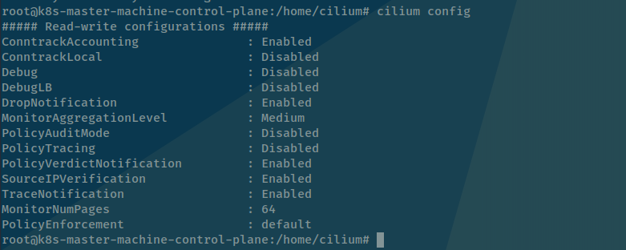

- Run a monitoring to capture all traffic like `tcpdump` inside cluster, with `monitor` command

```bash
# All Traffic monitoring
cilium monitor

# Monitoring with verbose version
cilium monitor -v

# Monitoring with only L7
cilium monitor -t l7
```

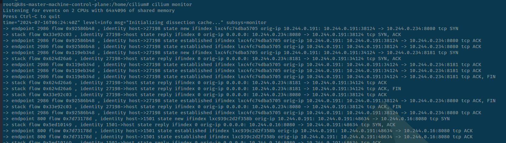


- Move on to check about `service` to view all loadbalancer services inside cluster

```bash
# View all services routing
cilium service list

# View specific services routing
cilium service get <id> -o json
```

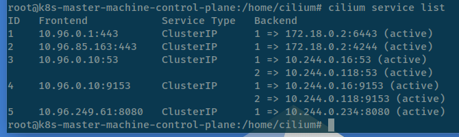

More over you can see about bpf level of load balancer

```bash
cilium bpf lb list
```

- See the `endpoint` inside cluster is useful optional in `cilium`

```bash
# Get list of all local endpoints
cilium endpoint list

# Get detailed view of endpoint properties and state
cilium endpoint get <id>

# Show recent endpoint specific log entries
cilium endpoint log <id>

# Turn on or off debug in monitor of target endpoint
cilium endpoint config <id> Debug=true
```

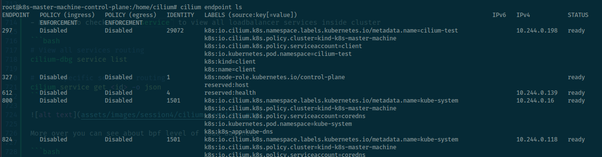

> `cilium` is more powerful, but if i list all, we will make this session become boring. So if you want to explore more features, check out at: https://docs.cilium.io/en/latest/cmdref/
 
### Enable `hubble` in cluster to see what network work inside the kubewekend cluster

Back to the cilium in shell of `vagrant` host, you need to turn of `hubble` with command

```bash
cilium hubble enable
```

And now use `status` to check if `hubble` run or not

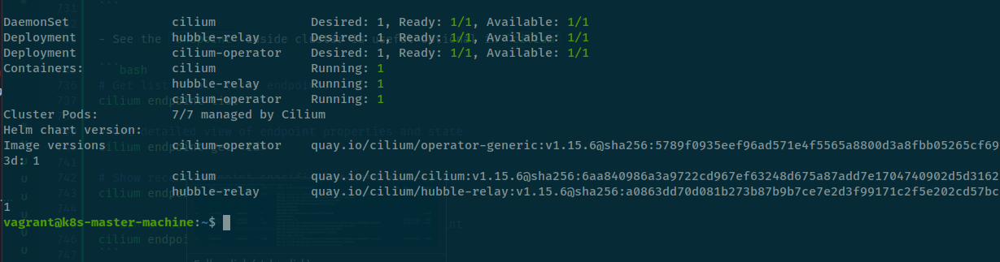

With hubble enable, kubewekend cluster will add a new thing run as deployment `hubble-relay`. But your version is deploy will not have any accesable, you need install add-on like `hubble-client` and `hubble-ui` to more visualize about `hubble`. Read more about `hubble` at: [What is hubble?](https://docs.cilium.io/en/latest/overview/intro/#what-is-hubble)

First of all, install `hubble-client` to use command in your host

```bash
HUBBLE_VERSION=$(curl -s https://raw.githubusercontent.com/cilium/hubble/master/stable.txt)
HUBBLE_ARCH=amd64
if [ "$(uname -m)" = "aarch64" ]; then HUBBLE_ARCH=arm64; fi
curl -L --fail --remote-name-all https://github.com/cilium/hubble/releases/download/$HUBBLE_VERSION/hubble-linux-${HUBBLE_ARCH}.tar.gz{,.sha256sum}
sha256sum --check hubble-linux-${HUBBLE_ARCH}.tar.gz.sha256sum
sudo tar xzvfC hubble-linux-${HUBBLE_ARCH}.tar.gz /usr/local/bin
rm hubble-linux-${HUBBLE_ARCH}.tar.gz{,.sha256sum}
```

Now validate the hubble API Access

> In order to access the Hubble API, create a port forward to the Hubble service from your local machine. This will allow you to connect the Hubble client to the local port 4245 and access the Hubble Relay service in your Kubernetes cluster.

```bash
# Use via cilium
cilium hubble port-forward

# use via kubectl
kubectl port-forward -n kube-system service/hubble-relay 4245:80
```

And lastly, you can view status and observe about `hubble` 

```bash
# View status
hubble status

# Observe API
hubble observe
```

<h3>Hubble Status</h3>

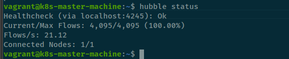

<h3>Hubble observe</h3>

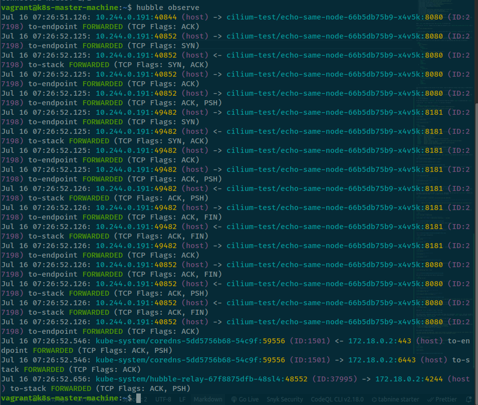


But if you don't view result of network traffic inside cluster via CLI, `hubble` offer us about using via web-ui. Use command below 


```bash
cilium hubble enable --ui
```

Wait for minite, and use `status` command with `cilium` to view your ui is enabling

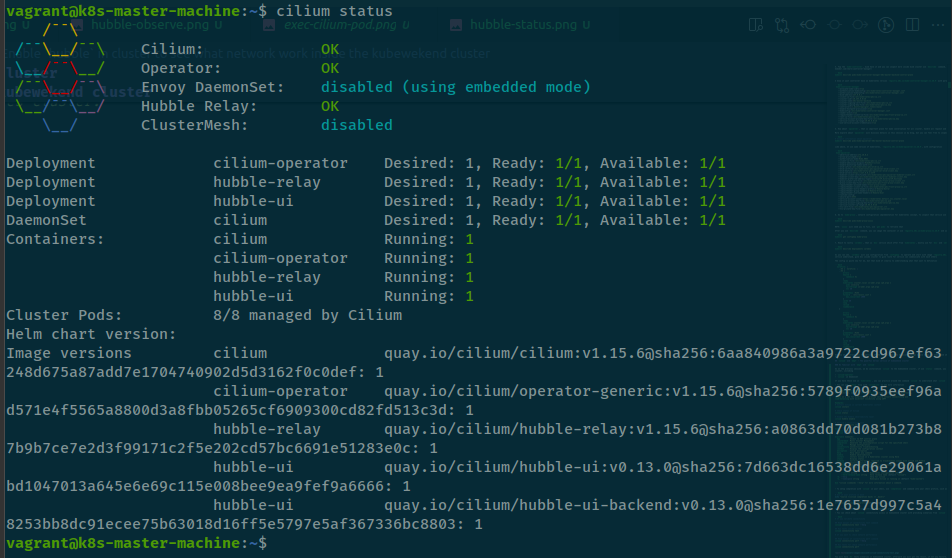

Use `port-forward` to expose web-ui to your localhost

```bash
# Use via cilium
cilium hubble ui

# Use port-foward of kubectl instead
kubectl port-forward -n kube-system service/hubble-ui 12000:80
```

You will hard to connect to `vagrant` host if you not attacked to `vmbox`, so instead of I use `ssh-tunnel` to connect `hubble-ui`

```bash
ssh -N -L 12000:127.0.0.1:12000 -i .vagrant/machines/k8s-master-machine/virtualbox/private_key vagrant@127.0.0.1 -p 6996
```

Now you can access `http://localhost:12000` to view web-ui of `hubble`

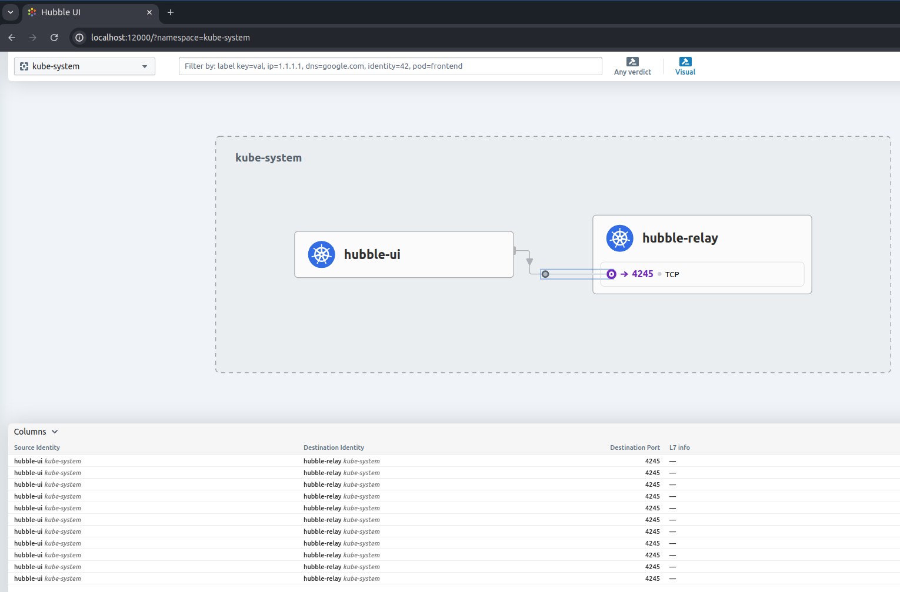

Inspect real time with example when use `connectivity` scenarios

```bash
while true; do cilium connectivity test; done
```


## Build and Operate High Availability (HA) `Kubewekend` Cluster

Read full article about session at [Kubewekend Session 5: Build HA Cluster](https://wiki.xeusnguyen.xyz/Tech-Second-Brain/Personal/Kubewekend/Kubewekend-Session-5)

### Dive deeper into Kubelet

> Honestly, kubelet is one of parts with most complicated and excited inside kubernetes and you need to spend many time understand what is behind the scene and what happen if your `kubelet` is dying, tough situation

`kubelet` usually run as service in system not run as workload in `kubernetes`, therefore if you want to see how `kubelet` service status, you can see via `systemd` inside machine

```bash
# Access vagrant host in control-plane
vagrant ssh k8s-master-machine

# After that access into docker where run `kind` engine inside
docker exec -it k8s-master-machine-control-plane /bin/bash

# Use can use journalctl, service or systemctl to make conversation to get information about kubelet
# With systemctl
systemctl status kubelet

# With service
service kubelet status

# With journalctl
journalctl -u kubelet | more # super detail
```
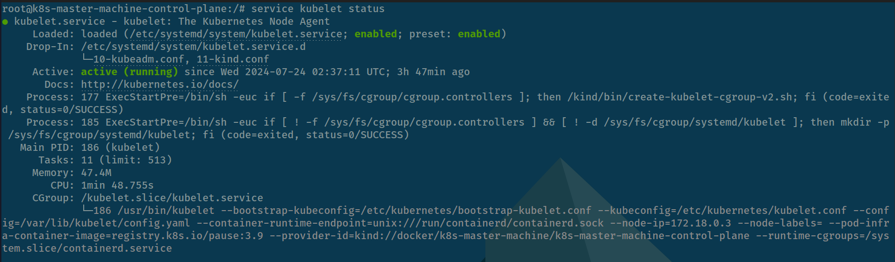

>If you can see you can see anything about kubelet, like `ID` `Memory` `Command` `CGroup` and many things will help you debug the problems, when you want to understand and hardcore use journalctl to figure out all of thread inside 🥶

When you dive into `kubelet` as command this one run, you can see where configuration to perform `kubelet` because `kubelet` is binary for execution

```bash
/usr/bin/kubelet --bootstrap-kubeconfig=/etc/kubernetes/bootstrap-kubelet.conf \
--kubeconfig=/etc/kubernetes/kubelet.conf \
--config=/var/lib/kubelet/config.yaml \
--container-runtime-endpoint=unix:///run/containerd/containerd.sock --node-ip=172.18.0.3 --node-labels= \
--pod-infra-container-image=registry.k8s.io/pause:3.9 \
--provider-id=kind://docker/k8s-master-machine/k8s-master-machine-control-plane \
--runtime-cgroups=/system.slice/containerd.service
```

Following this configuration, you can image `kubewekend` cluster has

- **As least one worker node will run inside control plane** if you not define another  one, that why we have `kubelet` inside `control-plane` image
- Use bootstrap `kubeconfig` at `/etc/kubernetes/bootstrap-kubelet.conf` - *Will be empty because we don't use any bootstrap to build up*
- Use `kubeconfig` at `/etc/kubernetes/kubelet.conf` - *Define about context of cluster like certificate and address of cluster to connect*
- Check about config at `/var/lib/kubelet/config.yaml` - *Same as configuration if you have look on session via API*
- Container runtime inside `image` use via `containerd.sock` - *socket container like `dockerd` but lightweight, usually use both of them, it better together. Read more at: [containerd vs. Docker: Understanding Their Relationship and How They Work Together](https://www.docker.com/blog/containerd-vs-docker/)*
- Next we see that provide `node-ip`, really same as the network which provide for `kind` container
- Use pod-infra-container-image as `pause:3.9` -  a container which holds the network namespace for the pod. Kubernetes creates pause containers to acquire the respective pod’s IP address and set up the network namespace for all other containers that join that pod. Read more at: [What is the use of a pause image in Kubernetes?](https://stackoverflow.com/questions/53258342/what-is-the-use-of-a-pause-image-in-kubernetes)
- Obviously use `kind` control-plane because that worker will associate via `kind`
- And lastly, runtime-cgroups to help `kubelet` can know about how much resource provide and permit to use via `containerd`

### Dynamic add nodes to kind cluster

> The purpose of created HA is help us on split the workload inside Kubernetes, and run in multiple machine or VM. With that idea, this will not cause any damage when worker node have problems, such as upgrade kubernetes and keep no downtime for your services, and add-on we can have more things to practical, actually about write customize scheduler 😄

In the first time and from documentation of `kind`, `kind` purpose release for running locally `kind` cluster inside docker of one machine, and may dream can be come true as well i figure out that one possible to do. Check out supberb article, [How to dynamically add nodes to a kind cluster](https://hackernoon.com/kubernetes-in-docker-adding-nodes-dynamically-to-a-kind-cluster) of  [Steve Sklar](https://hackernoon.com/u/sklarsa)

But not anything gonna easy when you join it, let't directly to see what happen

#### Not mount `kernel` to worker node

Now, we are starting, and first of all is create worker via using `Docker` command to create node with `kind` as container, but in the first time, you will stand between two situation down below

1. Succeed run `kubelet`

```bash
docker run --restart on-failure -v /lib/modules:/lib/modules:ro \
--privileged -h k8s-worker -d --network kind \
--network-alias k8s-worker --tmpfs /run --tmpfs /tmp \
--security-opt seccomp=unconfined --security-opt apparmor=unconfined \
--security-opt label=disable -v /var --name k8s-worker \
--label io.x-k8s.kind.cluster=kind --label io.x-k8s.kind.role=worker \
--env KIND_EXPERIMENTAL_CONTAINERD_SNAPSHOTTER \
kindest/node:v1.28.9
```

2. Failure run `kubelet`

```bash
docker run --restart on-failure \
--privileged -h k8s-worker -d --network kind \
--network-alias k8s-worker --tmpfs /run --tmpfs /tmp \
--security-opt seccomp=unconfined --security-opt apparmor=unconfined \
--security-opt label=disable -v /var --name k8s-worker \
--label io.x-k8s.kind.cluster=kind --label io.x-k8s.kind.role=worker \
--env KIND_EXPERIMENTAL_CONTAINERD_SNAPSHOTTER \
kindest/node:v1.28.9
```

> What is different between of them ? Answer: Not mount the volume where define your host kernel

As you can see, you need to mount `kernel` configuration into container which used by `kubelet` to connect with your machine via `-v /lib/modules:/lib/modules:ro`

Actually if you want to know about `kubelet` techniques stand behind, check out 

- [driver of container runtime](https://kubernetes.io/docs/setup/production-environment/container-runtimes/#systemd-cgroup-driver) in `cgroup` and `systemd` part  that components to control all process, resources inside the machine
- Explaining what is `systemd` and `cgroup` in Linux via article [Medium - Systemd and cgroup](https://medium.com/@charles.vissol/systemd-and-cgroup-7eb80a08234d)

Now when you run `docker` container in successful, and now we have worker node but that stand loneliness, so you need join that container to control plane. Currently, **Kubewekend cluster** is using `kind` to operate `control plane` via `kubeadm`, Read more principle and concept of `kind` at [kind Principles](https://kind.sigs.k8s.io/docs/design/principles/).

Following the step to create and join node in documentation, you can reproduce them inside `kind` via some steps

1. Create token

> Create a token which managed via control plane, and provide suitable command with token to help you in joining worker or another control plane to clusters

```bash
docker exec --privileged k8s-master-machine-control-plane \
kubeadm token create --print-join-command
```

2. Join to control plane

```bash
# Exec into worker container
docker exec -it k8s-worker /bin/bash

# Join with command kubeadm
kubeadm join k8s-master-machine-control-plane:6443 \
--token xxxxxx --discovery-token-ca-cert-hash sha256:xxxxx --skip-phases=preflight
```

> ❗️ Error
> When you don't use param --skip-phases=preflight, your command join will fail for 100%, because kubeadm will run and your kernel in machine not exist configs file to load full information about your kernel, see down below


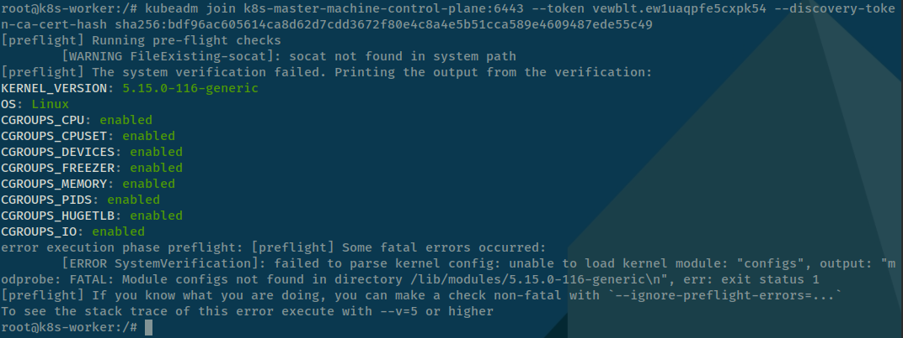

*Parameter `--skip-phases=preflight`, this step will help you bypass preflight of kubeadm step, reach you init and others stories will work great*

After you perform two step above, you actually join your `worker` node into clusters, retrieve that via command

```bash
kubectl get nodes
```

Story will become complex and pleasant on next part, another problems come up and you need actually to control your `kernel` and understand why it can't start your CNI and connect that with `CNI` and make your worker node become `Not Ready` state.

#### Can't not install `cilium CNI` inside worker node

Now we have problem not run `CNI` on worker node, you know `kubernetes` used auto discovery when have new node join to cluster, control plane will schedule to provide `daemonset` workload to inside worker node via `kubelet` and `kube-apiserver`, including

- kube-proxy ✅
- CSI - *not have this feature currently* ❌
- CNI - *Cilium and actually problems in currently* ❌

In the step to initialization the `cilium` and `kube-proxy`, `kube-proxy` work perfectly but CNI not run at all with multiple error number, sometime announce `2` or `137`

```bash
# Check status and state of pod
kubectl get pods -n kube-system -w

# Use to deeper inspected
kubectl describe pods/cilium-xxxx -n kube-system # CrashLoopBack
```
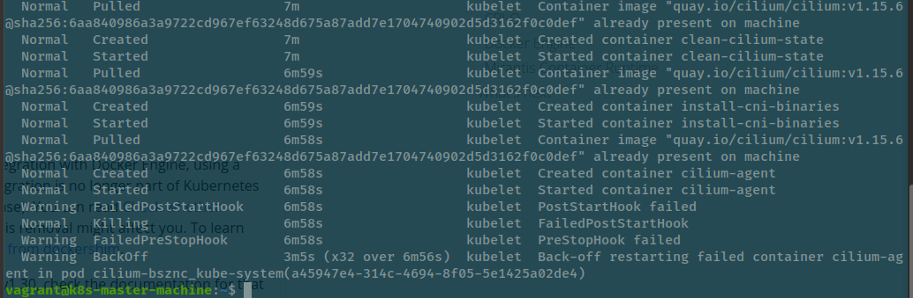

Check status of `kubelet` service inside new worker node

```bash
# Exec with docker inside new node
docker exec -it k8s-worker /bin/bash

# Try to log the status of kubelet service via journalctl and systemctl
systemctl status kubelet

journalctl -xeu kubelet
```

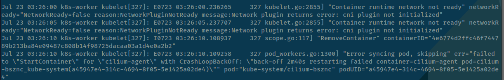

When check it that announce about `cilium` - our CNI was be killed by `PostStartHook` event and cause `FailedPostStartHook` inside **Kubewekend** cluster

First I try to stop `kubelet` service by systemd of `k8s-worker`, use 

```bash
systemctl stop kubelet
```

Next, try to run `kubelet` with command inside `kubelet` service with in refer in [[Kubewekend Session 5#Dive deeper into Kubelet|Dive deeper into Kubelet]] in previous part and force add `node-ip` because i think that cause problems

```bash
/usr/bin/kubelet --bootstrap-kubeconfig=/etc/kubernetes/bootstrap-kubelet.conf \
--kubeconfig=/etc/kubernetes/kubelet.conf \
--config=/var/lib/kubelet/config.yaml \
--container-runtime-endpoint=unix:///run/containerd/containerd.sock --node-ip=172.18.0.3 --node-labels= \
--pod-infra-container-image=registry.k8s.io/pause:3.9 \
--provider-id=kind://docker/k8s-master-machine/k8s-master-machine-control-plane \
--runtime-cgroups=/system.slice/containerd.service
```

But not the actually issue is really come up when I try to overview the error with huge information through what we got in running `kubelet` command.

And yup I detect about error make container crash in step run `cilium-agent`, see down-below

```bash
2710 kuberuntime_container.go:287] "Failed to execute PostStartHook" err="rpc error: code = Unknown desc = failed to exec in container: failed to start exec \"c3107b15e85a5b213e28a811b7341c153ec727ebf3c1a58b6c1d51bcd4f4e06b\": OCI runtime exec failed: exec failed: unable to start container process: error adding pid 3095 to cgroups: failed to write 3095: open /sys/fs/cgroup/unified/kubelet.slice/kubelet-kubepods.slice/kubelet-kubepods-burstable.slice/kubelet-kubepods-burstable-poda45947e4_314c_4694_8f05_5e1425a02de4.slice/cri-containerd-abb37780fc913b3720641a4039186adb06f5d1de0229de0e8707f12e2fde5a21.scope/cgroup.procs: no such file or directory: unknown" pod="kube-system/cilium-bsznc" podUID="a45947e4-314c-4694-8f05-5e1425a02de4" containerName="cilium-agent" containerID="containerd://abb37780fc913b3720641a4039186adb06f5d1de0229de0e8707f12e2fde5a21"
```

Something wrong inside the `cgroups` and cannot to giving pods `cilium` to create process and add them to group management. Try to search and access some issue in `github` - more information but useful 100%, and find out something can help as

- [(arm64) OCI runtime exec failed: exec failed: unable to start container process: error adding pid 791507 to cgroups](https://github.com/kubernetes-sigs/kind/issues/3366)
- [Kubernetes postStart lifecycle hook blocks CNI](https://stackoverflow.com/questions/55298354/kubernetes-poststart-lifecycle-hook-blocks-cni)

From the idea of **[BenTheElder](https://github.com/BenTheElder)** in the first issue link - whose maintain `kind` so he talk about `Older version of kernel machine when you kind version`. So let's think

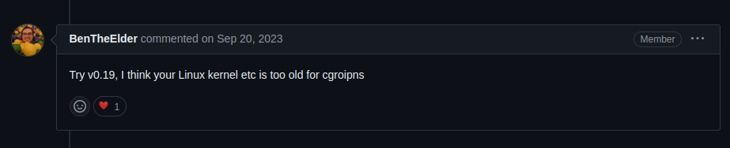

- We have newest `kind` version - 0.23.0 ❌
- We install the cluster in node version 1.28.9, still update and not deprecated, so it not come up from cluster image ❌

> Can I perform install kind in currently Ubuntu version ? Does it have any different ?

And that come up with actually warning

```bash
cgroupns not enabled! Please use cgroup v2, or cgroup v1 with cgroupns enabled.
```

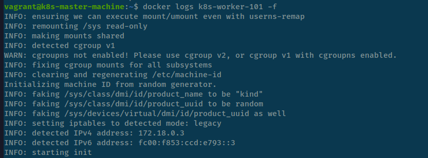

> Therefore, I try self-hosted `kind` on my machine in Ubuntu 22.04, with `kernel` version `6.5.0-44-generic` and in `vagrant` machine with Ubuntu 20.04, with `kernel` version `5.4.0-189-generic`. And It work when try to install `cilium` inside my Ubuntu with `kernel` version `6.5.0-44-generic` and not work with `vagrant`. Really suspicious, LOL 😄

And yup it really have 😅, therefore try to figure out problem and check about [requirement cilium](https://docs.cilium.io/en/stable/operations/system_requirements/)

Cilium need me install [Linux kernel](https://docs.cilium.io/en/stable/operations/system_requirements/#linux-kernel) >= **4.19.57** or equivalent (e.g., 4.18 on RHEL8) and luckily `vagrant` get to used it and one more, Ubuntu 20.04 is good enough with requirement on higher version **18.04.3**

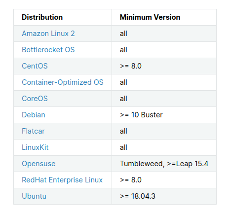

Try to setup with `kind-config.yaml` but add one more worker node, and try to install cilium and I does work, and now we know why the problem comeup

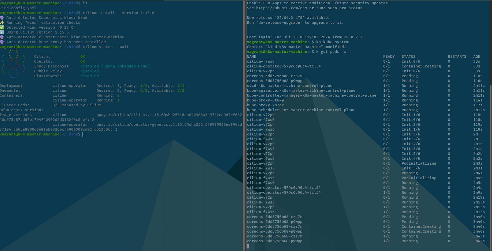

If you can see, `cgroup v1` in-use with node pre-provisioning via `kind-config` and rasise any warning about `cgroupns not enabled! Please use cgroup v2, or cgroup v1 with cgroupns enabled` 

BTW we can validate that not come from `kernel` version, or at least I don't know in this time and we know that have enough condition to run `cilium` inside worker node

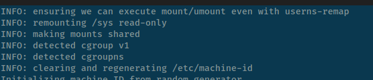

And you will figure out our situation can perform to exchange, including

- Risk: Install new kernel inside your vagrant host, need to make sure you know are you doing
- Safe: Update a new version Ubuntu for `vagrant` host to receive a compatible version of `kernel`

So following the safe option, I choose upgrade Ubuntu to new version 20.04 --> 22.04 and received new version kernel from `5.4.0-189-generic` to `5.15.0-116-generic`. Read more at [Update Ubuntu new version](https://wiki.xeusnguyen.xyz/Tech-Second-Brain/Operation-System/Linux-(Debian)/Shell-command-snippets#update-ubuntu-new-version)

> Done
And actually that resolve any problem you meet, so i think if you want to operate cilium at version 1.5 with old kernel you need downgrade your version of cilium, and do not use latest because of congestion inside the kernel

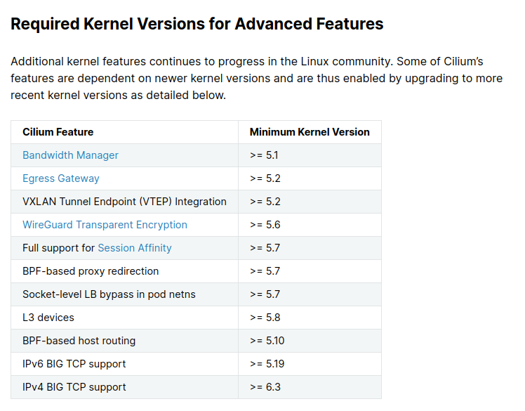

When redeploy and check log of `worker` node, as you can see it move on to using `cgroup v2`

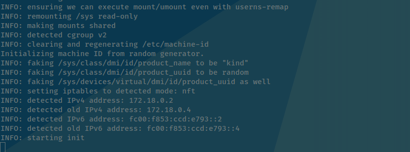

You can relate this feature on cluster architecture on `cgroup v2` at [Kubernetes Documentation - About cgroup v2](https://kubernetes.io/docs/concepts/architecture/cgroups/)


### Use `vmbox` to join worker node into master node

I know about there are more alternative out there which cut off the effort when self-hosted and join worker via `kubeadm` like

- [kubespray](https://github.com/kubernetes-sigs/kubespray) - *Deploy a Production Ready Kubernetes Cluster*
- [K3s](https://docs.k3s.io/) -  *Lightweight Kubernetes. Easy to install, half the memory, all in a binary of less than 100 MB*

Use `vagrant` again to create add one worker machine like we doing on session 1, if you are done with this step, reach to next 😄

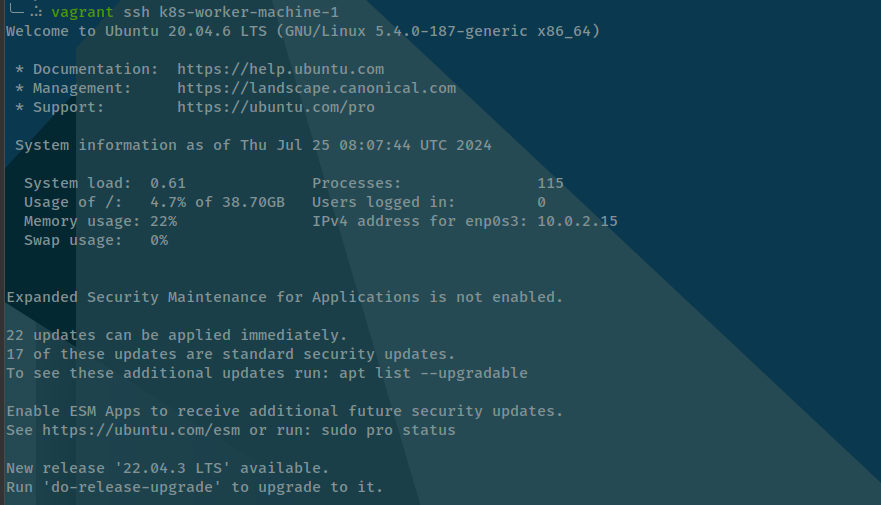

#### Attach your machine with `Nat Network`

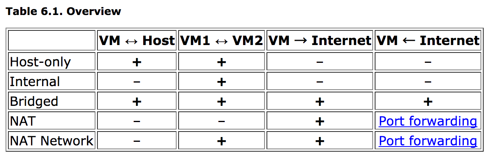

Following image, our machines is using `NAT` and it will not connect with others, so we need use alternative plan for networking, such as `Bridged` and `NAT Network` but recommend you use `NAT Network` with purpose learning and flexible than `Bridged`

First, I have practice with scripting for help you automation all step when hand on creating network and give machine interact, but many issue let me not image why 😿

- `Vagrant` make me so annoy when change new network configuration for adapter, worker node will lost all information SSH of host 😅
- When applied network, It causes your host **stuck in boot** state when you try shutdown and update new interface. Not actually methodology to check machine boot succeed or not

You can approach that inside script in [hook-up-ip.sh](./script/hook-up-ip.sh), but you can meet the trouble for sure, not easily BTW 🤭. Feel free take your machine back with [return-to-nat.sh](script/return-to-nat.sh)

Therefore, to not waste your time, you can use `UI` for instead, not cover much but we can use both UI and CLI during progress

1. First of all create networks for whole VM in cluster follow step Choose `Tools` -> `Network` --> Choose `NAT Networks` Tab -> Click Create Button --> Change information in General Options

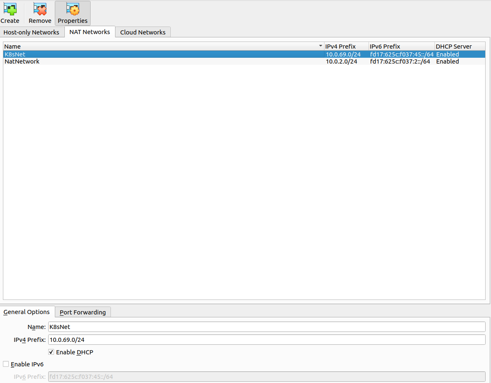

2. Choose `network` in configuration of VM, such as `k8s-master-machine`

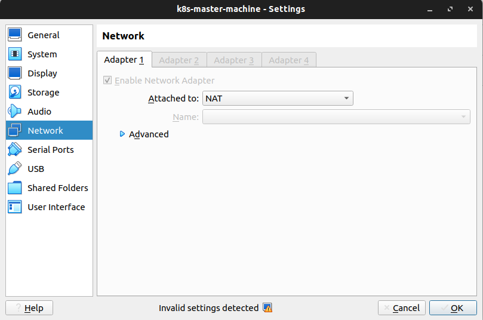

3. On the network, in part `attached to` change from `NAT` --> `NAT Network` and select your network which you create

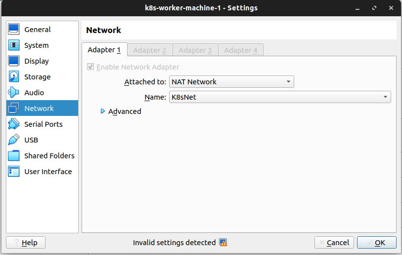

4. Approve and recheck inside the machine with provide new IP Address via DHCP, but at currently you can access host via `vagrant`, use `VMBoxManage` to retrieve info of machine. [Documentation](https://www.virtualbox.org/manual/ch08.html#vboxmanage-guestproperty)

   ```bash
   VBoxManage guestproperty get <vm-name> "/VirtualBox/GuestInfo/Net/0/V4/IP";
   ```
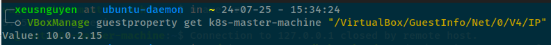

5. But before recheck, use need to port forward again for port to ssh inside that machine as `Tools` --> `NAT Networks` --> Choose name of NAT network --> Choose `Port Forwarding` in the bottom --> Click add rule --> Provide information for rule --> Apply

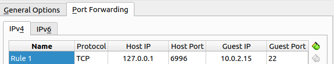

6. Access again with `vagrant ssh` and now you are connecting to `k8s-master-machine` via `NAT Networking`, but with `k8s-worker-machine-x` have some different to connect, you need use `ssh` instead because your `ssh-config` with vagrant is changing via host configuration

   ```bash
   # Use vagrant
   vagrant ssh k8s-worker-machine-1

   # Use SSH
   ssh -i .vagrant/machines/k8s-worker-machine-1/virtualbox/private_key \
   -o IdentitiesOnly=yes vagrant@127.0.0.1 -p 9669
   ```

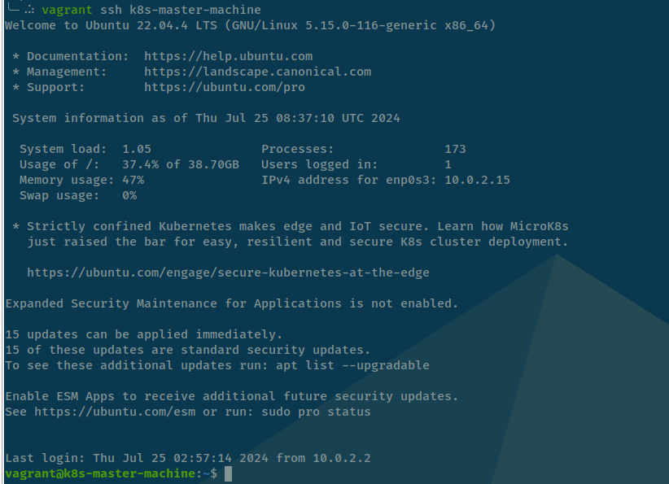

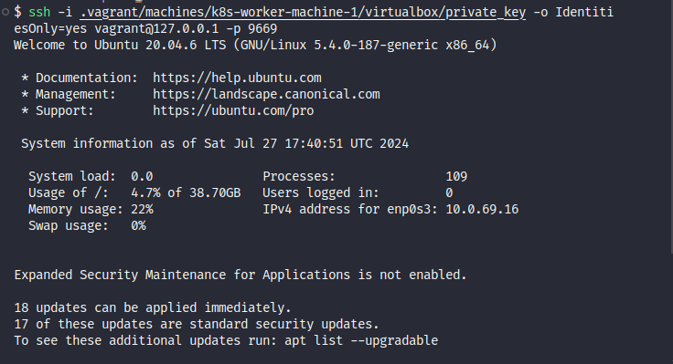


Now you can validate connection between `master` and `worker` with ping command

```bash
# Exam: Master: 10.96.69.4, Worker: 10.96.69.5
ping -4 10.96.69.4 # From worker node
ping -4 10.96.69.5 # From master node
```

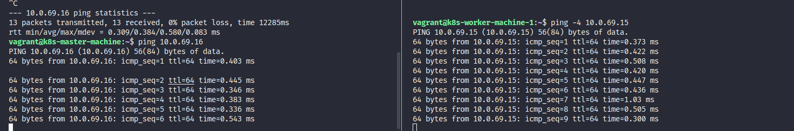

Now our host is connected, moving on to update kernel on two host to `5.15.0-116-generic` and reaching self-hosted `kubewekend` cluster

```bash
# Update kernel
sudo apt install linux-virtual-hwe-20.04 -y

# Reboot and wait
sudo shutdown -r now 
```

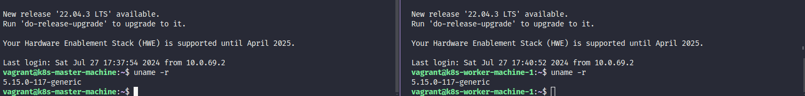

#### Do some step with configuration `cgroup`

And now we will try run `kind` and `worker` node with docker in the second part of session [[Kubewekend Session 5#Dynamic add nodes to kind cluster|Dynamic add nodes to kind cluster]] and poorly we need to update your cluster to new one version because of `20.04` will change your kernel but `cgroup v1` is still alive and do not use `cgroup v2` and it makes our host can't be run `cilium cni` if not actually configuration

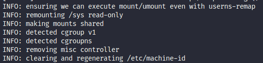

>

In the individual in upgrading `kernel`, It will not actually upgrade your `cgroup` to new version but your machine can be use `cgroup v2` but need to configuration, therefore you have two optional

- Upgrade to new version, It means you can re-provisioning your machine with `Ubuntu jammy 22.04` or use command to update. [Vagrant Ubuntu 22.04](https://app.vagrantup.com/ubuntu/boxes/jammy64)
- Change daemon to enable `cgroupns`, and help your docker daemon can execute and understand what state of it

>I know that will tough option which you need to choose, follow me if you don't want to cause any trouble you should choose option 1, but if you want to explore more about `cgroup` and `systemd` maybe options 2 can be best choice
>
>As I can say, I will try hard path in this session, if you want to make option 1, please follow [[Kubewekend Session 5#Dynamic add nodes to kind cluster|Part 2]] of session to figure out how to upgrade OS 🙌

If you choose optional 2, you are brave men buddy. We will have two option in optional 2 and I can guide you at all and can be applied one of them if you want

- Continuous use `cgroupv1` but enable `cgroupns`, and it can make sure your can be better to 
- Applied `cgroup v2` to try upgrade some configuration of `systemd`

With continuing use `cgroupv1` and enable `cgroupns`, you can explore at: [Systemd fails to run in a docker container when using cgroupv2 (--cgroupns=private)](https://serverfault.com/questions/1053187/systemd-fails-to-run-in-a-docker-container-when-using-cgroupv2-cgroupns-priva), It will require you add more flag inside command to give your docker-daemon can enable `cgroupns` feature with flag

- `--cgroup-parent=docker.slice` : [Specify custom cgroups](https://docs.docker.com/reference/cli/docker/container/run/#cgroup-parent), It means you can choose what cgroup running inside `docker`
- `--cgroupns`:  `cgroup` namespace to use (host|private), and you need to change to `private` if you run own private `cgroup` namespace

```bash {5}
docker run --restart on-failure -v /lib/modules:/lib/modules:ro --privileged \
-h k8s-worker -d --network kind --network-alias k8s-worker --tmpfs /run --tmpfs /tmp \
--security-opt seccomp=unconfined --security-opt apparmor=unconfined --security-opt label=disable -v /var \
--name k8s-worker --label io.x-k8s.kind.cluster=kind --label io.x-k8s.kind.role=worker --env KIND_EXPERIMENTAL_CONTAINERD_SNAPSHOTTER \
--cgroup-parent=docker.slice --cgroupns private \
kindest/node:v1.28.9
```

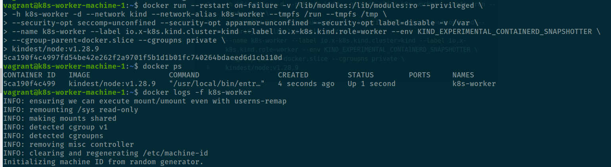

Now your container is running both `cgroup v1` and `cgroupns` inside `worker` container, so how about `cgroupv2` is actually work, answer is yes when you update new kernel for your machine you have `cgroupv2` in the system but currently your host is not to use `cgroupv2` as default, we will learn how to do that via `update-grub` and try to set `worker` node use `cgroupv2`
  
When you validate your host support `cgroupv2`, use `grep` and find at `/proc/mounts`

```bash
grep cgroup /proc/mounts
```
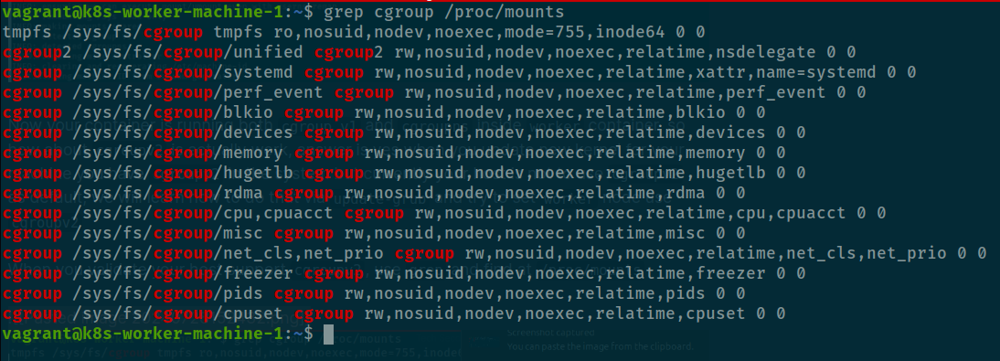

Or you can use `grep` with `/proc/filesystems`, explore at [How do I check cgroup v2 is installed on my machine?](https://unix.stackexchange.com/questions/471476/how-do-i-check-cgroup-v2-is-installed-on-my-machine)

```bash
grep cgroup /proc/filesystems
```
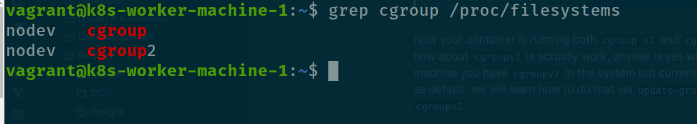

If machine only support `cgroupv1` you will not see any line `cgroup2` and how you can adapt your machine into `cgroupv2`, you can modify `grub` and boot your `host` with level 2, It means disable `cgroupv1` as default and only use `cgroupv2`

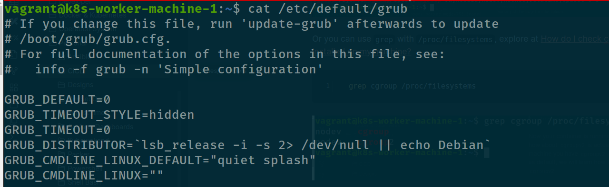

Following discussion [Error: The image used by this instance requires a CGroupV1 host system when using clustering](https://discuss.linuxcontainers.org/t/error-the-image-used-by-this-instance-requires-a-cgroupv1-host-system-when-using-clustering/13885/1), in the line `GRUB_CMDLINE_LINUX`, try to add `systemd.unified_cgroup_hierarchy=1` and try update grub again

```bash
# Open you host with grub
sudo nano /etc/default/grub

# Try to modify the line and update with
sudo update-grub

# Reboot to ensure again, not probably but good to you
sudo shutdown -r now
```

And now try to run `worker` node and see what is going on

```bash
docker run --restart on-failure -v /lib/modules:/lib/modules:ro --privileged -h k8s-worker -d --network kind --network-alias k8s-worker --tmpfs /run --tmpfs /tmp --security-opt seccomp=unconfined --security-opt apparmor=unconfined --security-opt label=disable -v /var --name k8s-worker --label io.x-k8s.kind.cluster=kind --label io.x-k8s.kind.role=worker --env KIND_EXPERIMENTAL_CONTAINERD_SNAPSHOTTER kindest/node:v1.28.9
```

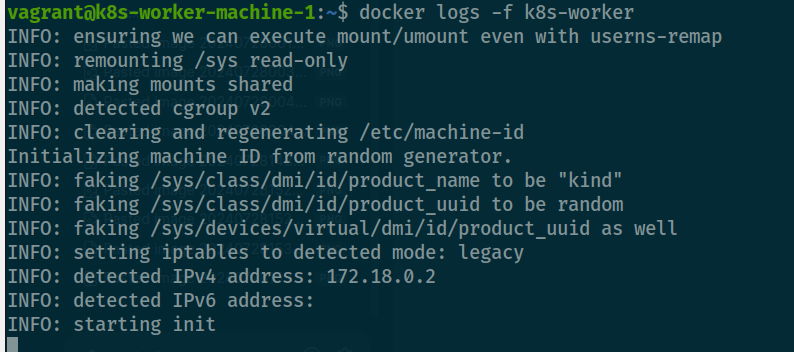

Your host is currently use `cgroupv2` and awesome 😄, follow this article to know more buddy [cgroup v2](https://rootlesscontaine.rs/getting-started/common/cgroup2/)

#### Connect your worker to master via `kubeadm`

If you catch up workflow, the part will last perform in this session, and we need to make sure your connection between master and worker machine

>[!warning]
>Because `kind` is not create to purpose when you can use between machine, we enforce `kind` to do it so that cause annoy when you failure, I know about that tough and `vagrant` host is not easily when change to `NAT` --> `NAT Network`

Therefore, just practice in this session because HA is not good with `kind`, maybe you use alternative tools can be better but `kind` is target and our competition in this series that why we need to pleasure with that one.

You need alternative `Vagrantfile` to prevent much annoy when you can't connect to VM when change new network, following new `Vagrantfile` to resolve the problem to connect worker vm via ssh

Change your `network` adapter of worker node to `NAT` and run `vagrant reload` to reconfiguration again

```bash
vagrant reload k8s-worker-machine-1
```

After running `reload`, you change again to `natnetworks` and check `ssh-config`, the surprise your `ssh` is keep not like as when you build your `worker` node in the loop and turn on `autocorrect: true` network

```bash
# Retrieve the ip and change that for portforwading rule
VBoxManage guestproperty get "k8s-worker-machine-1" \
"/VirtualBox/GuestInfo/Net/0/V4/IP" | cut -d ":" -f2 | xargs
```

Try `ssh` command

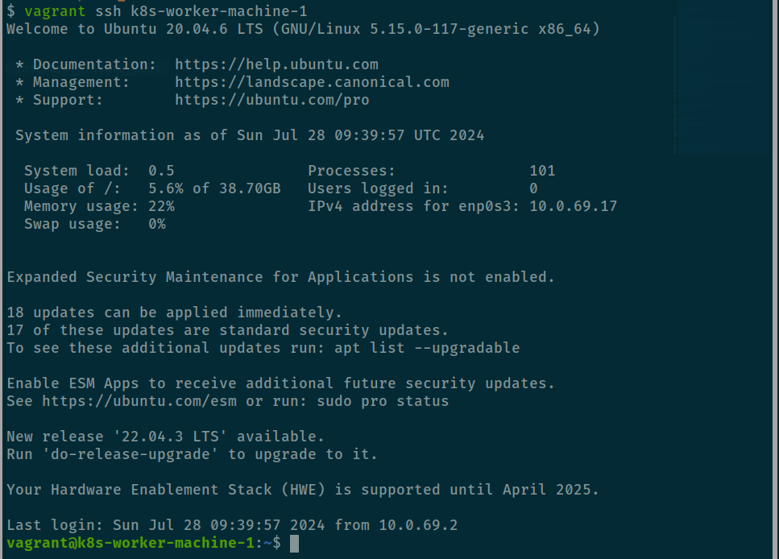

If you have problem, please destroy --> up your machine again to applied new network adapter. When you run `ssh` succeed into your host, run `worker` node but you need add more host to `worker` container because we need that can interact with machine because that give network can interact and connect via host at `/etc/hosts`. Read more at  [Add entries to container hosts file (--add-host)](https://docs.docker.com/reference/cli/docker/container/run/#add-host)

```bash
docker run --restart on-failure -v /lib/modules:/lib/modules:ro \
--privileged -h k8s-worker -d --network kind --network-alias k8s-worker \
--tmpfs /run --tmpfs /tmp \
--security-opt seccomp=unconfined --security-opt apparmor=unconfined --security-opt label=disable \
-v /var --name k8s-worker \
--label io.x-k8s.kind.cluster=kind --label io.x-k8s.kind.role=worker \
--env KIND_EXPERIMENTAL_CONTAINERD_SNAPSHOTTER \
--add-host "host.docker.internal:host-gateway" \
kindest/node:v1.28.9
```

Now you run succeed container and you need to exec some command inside to check your host can interact with `master` node

```bash
docker exec -it k8s-worker /bin/bash
```

In you `master` machine, host simple webserver with python to see they can interact with others inside `worker` container

```bash
# In master node
python3 -m http.server 9999

# In container worker node run command to hit webserver in port 9999. For example, IP of master will 10.0.69.15, you can
curl 10.0.69.15:9999
```

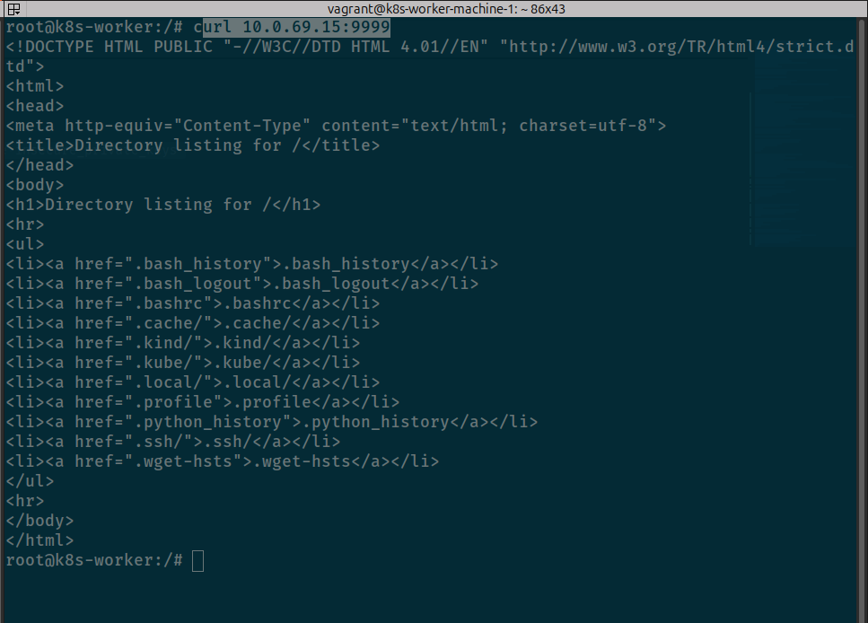

Change configuration inside `kubeadm` of master node to success provide right token connection string for worker node join into

First of all, try connect to your `master` container

```bash
docker exec -it k8s-master-machine-control-plane /bin/bash
```

Now find your `kubeadm` configuration and try to add your `host` to make your node can interact with `master` IP

```bash
kubectl -n kube-system get configmap kubeadm-config -o jsonpath='{.data.ClusterConfiguration}' > kubeadm.yaml
```

```yaml title="kubeadm.yaml"
apiServer:
  certSANs:
  - localhost
  - 0.0.0.0
  extraArgs:
    authorization-mode: Node,RBAC
    runtime-config: ""
  timeoutForControlPlane: 4m0s
apiVersion: kubeadm.k8s.io/v1beta3
certificatesDir: /etc/kubernetes/pki
clusterName: kubewekend
controlPlaneEndpoint: kubewekend-control-plane:6443
controllerManager:
  extraArgs:
    enable-hostpath-provisioner: "true"
dns: {}
etcd:
  local:
    dataDir: /var/lib/etcd
imageRepository: registry.k8s.io
kind: ClusterConfiguration
kubernetesVersion: v1.28.9
networking:
  dnsDomain: cluster.local
  podSubnet: 10.244.0.0/16
  serviceSubnet: 10.96.0.0/16
scheduler: {}
```

As you can see only `0.0.0.0` and `localhost` as we discussion, so you `nano` try add your host IP below list in `certSANs`

```bash title="new-kubeadm.yaml" {5}
apiServer:
  certSANs:
  - localhost
  - 0.0.0.0
  - 10.0.69.15
  extraArgs:
    authorization-mode: Node,RBAC
    runtime-config: ""
  timeoutForControlPlane: 4m0s
apiVersion: kubeadm.k8s.io/v1beta3
certificatesDir: /etc/kubernetes/pki
clusterName: kubewekend
controlPlaneEndpoint: 10.0.69.15:6443
controllerManager:
  extraArgs:
    enable-hostpath-provisioner: "true"
dns: {}
etcd:
  local:
    dataDir: /var/lib/etcd
imageRepository: registry.k8s.io
kind: ClusterConfiguration
kubernetesVersion: v1.28.9
networking:
  dnsDomain: cluster.local
  podSubnet: 10.244.0.0/16
  serviceSubnet: 10.96.0.0/16
scheduler: {}
```

Now move the old certificates to another folder, otherwise kubeadm will not recreate new ones

```bash
mv /etc/kubernetes/pki/apiserver.{crt,key} ~
```

Use `kubeadm` to generate new `apiserver` certificates

```bash
kubeadm init phase certs apiserver --config kubeadm.yaml
```

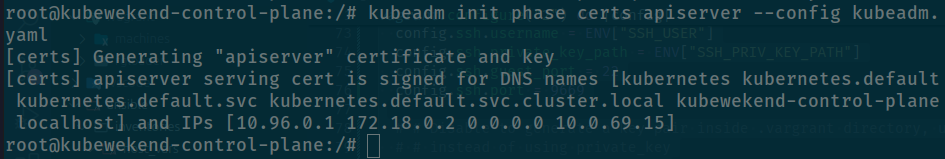

Delete pod `kube-apiserver` or use can use `kill -9` to delete process of `kube-apiserver`

```bash
# Some time be in stuck and not know reason :)
kubectl delete pods -n kube-system kube-apiserver-k8s-master-machine-control-plane

# Try with ps
ps aux | grep -e "kube-apiserver"
```

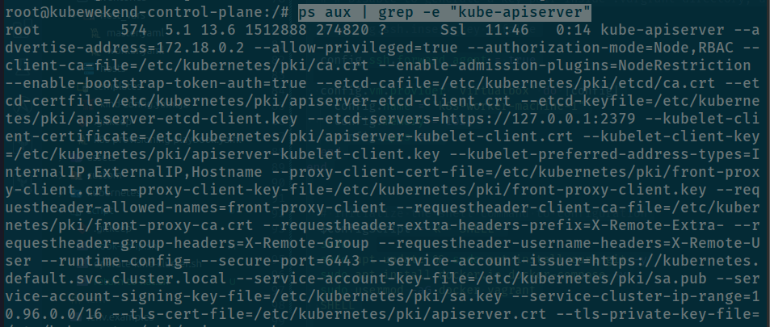


```bash
# Kill your process with attach for kube-apiserver
kill -9 <pid>
```

After try update new configuration to configmap

```bash
kubeadm init phase upload-config kubeadm --config kubeadm.yaml
```

And before generate token, you need to change `cluster-info` to help worker can fetch this one and applied to worker. Read more at [kubeadm join failed: unable to fetch the kubeadm-config ConfigMap](https://github.com/kubernetes/kubeadm/issues/1596)

Issue ask me about to reconfiguration both `kubeadm.yaml` (Done) but configmap of `cluster-info` is not upgrade, so we need to update that, but first retrieve that with command

```bash
kubectl get cm cluster-info -o yaml -n kube-public
```

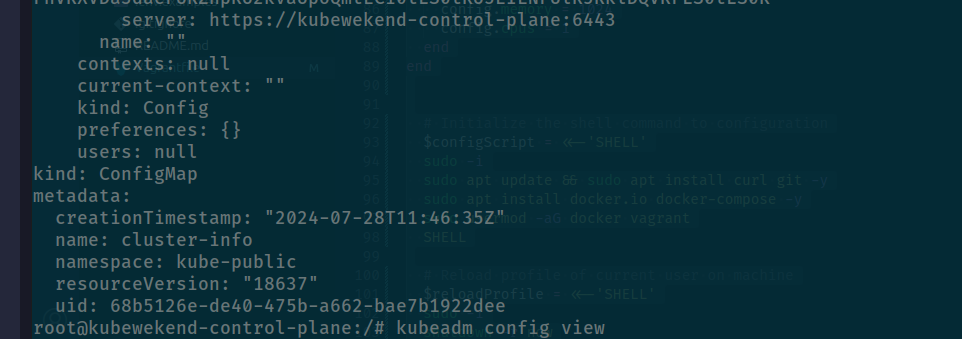

Currently server is not configuration to IP so we need to edit that we can use `kubectl edit` to update configmap

```bash
# Change default editor to nano
export KUBE_EDITOR=nano

# Edit config map
kubectl edit cm cluster-info -n kube-public
```

After save and update, we reload `kube-apiserver` and `kubelet` of master node if needed but first try with `kube-apiserver` as kill container

```bash
kubectl delete pods/kube-apiserver-kubewekend-control-plane -n kube-system
```

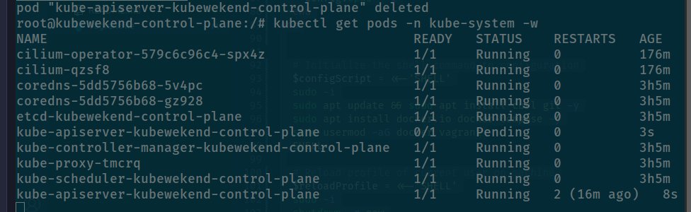

and now you can generete join command and connect worker to master

```bash
# Master
docker exec --privileged k8s-master-machine-control-plane \
kubeadm token create --print-join-command

# Worker
# Exec into worker container
docker exec -it k8s-worker /bin/bash

# Join with command kubeadm
kubeadm join k8s-master-machine-control-plane:6443 \
--token xxxxxx --discovery-token-ca-cert-hash sha256:xxxxx --skip-phases=preflight
```

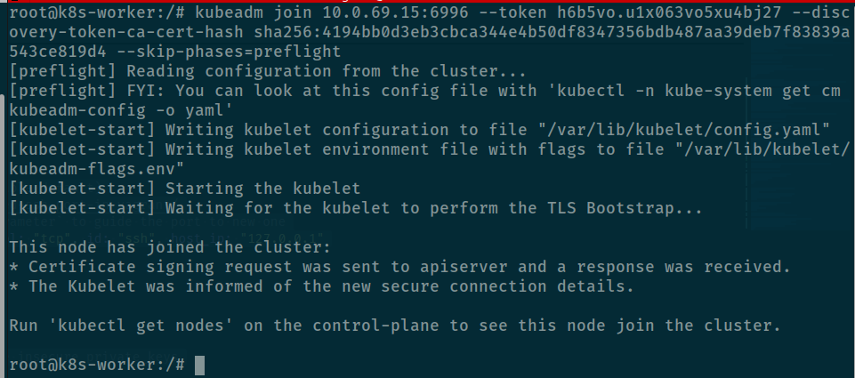

And finally we can connect addition `worker` host into `master`, that is huge progress to get this result

But your CNI need to change something to succeed fully work, because of timeout when try connect to apiserver with `dns` mapping

```bash
time="2024-07-28T15:07:03Z" level=info msg=Invoked duration=1.530641ms function="github.com/cilium/cilium/cilium-dbg/cmd.glob..func39 (cmd/build-config.go:32)" subsys=hive
time="2024-07-28T15:07:03Z" level=info msg=Starting subsys=hive
time="2024-07-28T15:07:03Z" level=info msg="Establishing connection to apiserver" host="https://10.96.0.1:443" subsys=k8s-client
time="2024-07-28T15:07:38Z" level=info msg="Establishing connection to apiserver" host="https://10.96.0.1:443" subsys=k8s-client
time="2024-07-28T15:08:08Z" level=error msg="Unable to contact k8s api-server" error="Get \"https://10.96.0.1:443/api/v1/namespaces/kube-system\": dial tcp 10.96.0.1:443: i/o timeout" ipAddr="https://10.96.0.1:443" subsys=k8s-client
time="2024-07-28T15:08:08Z" level=error msg="Start hook failed" error="Get \"https://10.96.0.1:443/api/v1/namespaces/kube-system\": dial tcp 10.96.0.1:443: i/o timeout" function="client.(*compositeClientset).onStart" subsys=hive
time="2024-07-28T15:08:08Z" level=info msg=Stopping subsys=hive
Error: Build config failed: failed to start: Get "https://10.96.0.1:443/api/v1/namespaces/kube-system": dial tcp 10.96.0.1:443: i/o timeout
```

And issue be resolved via some issue and documentation, help us reconfiguration `CNI` with Cilium

- [Kubernetes Without kube-proxy](https://docs.cilium.io/en/stable/network/kubernetes/kubeproxy-free/)
- [Unable to contact k8s api-server and Unable to initialize Kubernetes subsystem](https://github.com/cilium/cilium/issues/20679)

So we will uninstall CNI and try to install again with right configuration

```bash
# Uninstall Cilium out of cluster
cilium uninstall --wait

# Install again with configuration
# E.g: Kubeapi-server IP: 10.0.69.15 and Port: 6996
cilium install --version 1.15.6 --set k8sServiceHost=10.0.69.15 --set k8sServicePort=6996
```

And after applied we have ready node as we expected

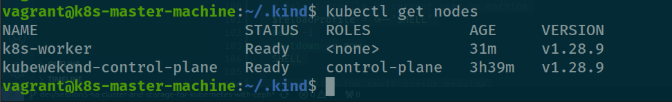
