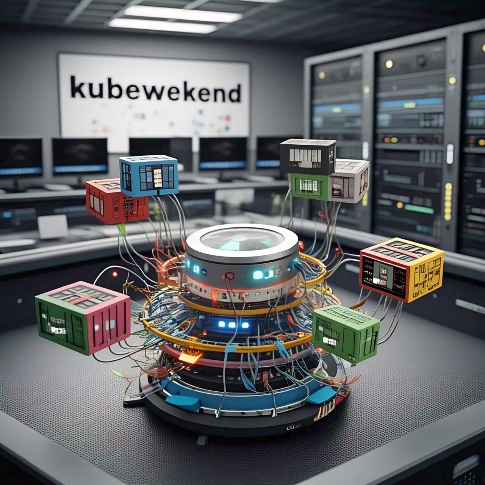

<h1>Setup the fully kubernetes cluster inside the locally hosted</h1>

<div align="center">
	
</div>

<h2>Table of Contents</h2>

- [Usage](#usage)
  - [Requirements tools](#requirements-tools)
  - [Step by step](#step-by-step)
  - [Specific Vagrantfile](#specific-vagrantfile)
- [Kubewekend Major Session](#kubewekend-major-session)
  - [Kubewekend Session 1: Use `Vargrant` to configuration the VM with provider](#kubewekend-session-1-use-vargrant-to-configuration-the-vm-with-provider)
  - [Kubewekend Session 2: Ansible - To setup and run script and bring up kubernetes cluster on locally, Use `kind`](#kubewekend-session-2-ansible---to-setup-and-run-script-and-bring-up-kubernetes-cluster-on-locally-use-kind)
  - [Kubewekend Session 3: Exploring, understanding and provisioning require components inside the `kind` cluster](#kubewekend-session-3-exploring-understanding-and-provisioning-require-components-inside-the-kind-cluster)
  - [Kubewekend Session 4: `cilium` and `ebpf` - The powerful kernal service of kubewekend cluster](#kubewekend-session-4-cilium-and-ebpf---the-powerful-kernal-service-of-kubewekend-cluster)
  - [Kubewekend Session 5: Build and Operate High Availability (HA) `Kubewekend` Cluster](#kubewekend-session-5-build-and-operate-high-availability-ha-kubewekend-cluster)
  - [Kubewekend Session 6: CSI and Ceph with Kubewekend](#kubewekend-session-6-csi-and-ceph-with-kubewekend)
- [Kubewekend Extra Session](#kubewekend-extra-session)
  - [Kubewekend Session Extra 1: Longhorn and the story about NFS in Kubernetes](#kubewekend-session-extra-1-longhorn-and-the-story-about-nfs-in-kubernetes)
  - [Kubewekend Session Extra 2: Rebuild Cluster with RKE2 or K3S](#kubewekend-session-extra-2-rebuild-cluster-with-rke2-or-k3s)

## Usage

### Requirements tools

  - Install [virtualbox](https://www.virtualbox.org/wiki/Downloads)
  - Install [vagrant](https://developer.hashicorp.com/vagrant/docs/installation)

### Step by step

1. Location on the root of project
2. Set environment from file `.env` or manually configure

```bash
# Manually
export SSH_USER="vargrant-user"
export SSH_PRIV_KEY_PATH="~/.ssh/vmbox"

# Use .env file
cp -r template.env .env
set -o allexport && source .env && set +o allexport
```
3. Up your `vagrant` via `virtualbox` by

```bash
# Use can use another provider: https://developer.hashicorp.com/vagrant/docs/providers
# Provision 1 master and 1 worker
vagrant up k8s-master-machine k8s-worker-machine-1 --provider=virtualbox

# You can provision more worker with regex pattern
vagrant up "/k8s-worker-machine-[2-3]/" --provider=virtualbox
```
### Specific Vagrantfile

> [!IMPORTANT]
> In repositories will be defined some `Vagrantfile` for two type K8s for base and ceph, for specific the Vagrantfile you should specific them via environment variables. Explore more at: [StackOverFlow - Specify Vagrantfile path explicity, if not plugin](https://stackoverflow.com/questions/17308629/specify-vagrantfile-path-explicity-if-not-plugin)

```bash
# Run as usual for base version
vagrant up <name-machine>

# Run specific Vagrantfile for CEPH version
VAGRANT_VAGRANTFILE=Vagrantfile.ceph vagrant up <name-machine>
```

## Kubewekend Major Session

### Kubewekend Session 1: Use `Vargrant` to configuration the VM with provider

> [!NOTE]
> This lab is take the topic around play and practice with `vagrant` - the software can help you provide the virtual machine in your host. First step way to setup `kubernetes` cluster inside your machine, and play with on next session

Read full article about session at [Kubewekend Session 1: Build up your host with Vagrant](https://wiki.xeusnguyen.xyz/Tech-Second-Brain/Personal/Kubewekend/Kubewekend-Session-1)

### Kubewekend Session 2: Ansible - To setup and run script and bring up kubernetes cluster on locally, Use `kind`

> [!NOTE]
> This lab is practice with ansible the configuration for setup `kind` cluster inside machine on the previous session

Read full article about session at [Kubewekend Session 2: Setup Kind cluster with Ansible](https://wiki.xeusnguyen.xyz/Tech-Second-Brain/Personal/Kubewekend/Kubewekend-Session-2)

### Kubewekend Session 3: Exploring, understanding and provisioning require components inside the `kind` cluster

> [!NOTE]
> This session talk about basically architecture and learn more fundamental components inside kubernetes, and what the structure of them inside clusters

Read full article about session at [Kubewekend Session 3: Basically about Kubernetes architecture](https://wiki.xeusnguyen.xyz/Tech-Second-Brain/Personal/Kubewekend/Kubewekend-Session-3)

### Kubewekend Session 4: `cilium` and `ebpf` - The powerful kernal service of kubewekend cluster

> [!NOTE]
> This session will talk and learn about eBPF and the especially representation of eBPF are cilium and hubble to become main CNI of Kubewekend and talk about Observability of them

Read full article about session at [Kubewekend Session 4: Learn about ebpf with hubble and cilium](https://wiki.xeusnguyen.xyz/Tech-Second-Brain/Personal/Kubewekend/Kubewekend-Session-4)

### Kubewekend Session 5: Build and Operate High Availability (HA) `Kubewekend` Cluster

> [!NOTE]
> This session is really pleasant when we talk about how can create HA cluster with `kubewekend`, learn more the components inside `kubernetes` and try figure out about `network`, `security`, `configuration`, `container runtime` and `system` via this session

Read full article about session at [Kubewekend Session 5: Build HA Cluster](https://wiki.xeusnguyen.xyz/Tech-Second-Brain/Personal/Kubewekend/Kubewekend-Session-5)

### Kubewekend Session 6: CSI and Ceph with Kubewekend

> [!NOTE]
> This session is covered about topic storage inside `Kubernetes` cluster, how can they work with `CSI` Architecture and why we need to `CSI Driver` for handle this stuff. Furthermore, I try to practice with `Ceph` - one of popular storage opensource for `Kubewekend` cluster

Read full article about session at [Kubewekend 6: CSI and Ceph with Kubewekend](https://wiki.xeusnguyen.xyz/Tech-Second-Brain/Personal/Kubewekend/Kubewekend-Session-6)


## Kubewekend Extra Session

### Kubewekend Session Extra 1: Longhorn and the story about NFS in Kubernetes

> [!NOTE]
> This lab is try to take you to journey to learn about new CSI for Kubernetes, `Longhorn` and deliver you to new method to handle transfer large file via network by NFS protocol. I also provide more information about `iSCSI`, `nfs-ganesha` and technique `rdma`

Read full article about session at [Kubewekend Session Extra 1: Longhorn and the story about NFS in Kubernetes](https://wiki.xeusnguyen.xyz/Tech-Second-Brain/Personal/Kubewekend/Kubewekend-Session-Extra-1)


### Kubewekend Session Extra 2: Rebuild Cluster with RKE2 or K3S

> [!NOTE]
> This article aims to provide you with insights into alternatives for self-hosting a full Kubernetes cluster. Both K3s and RKE2 are strong contenders worth considering to guide your decision. Focusing on the self-hosted approach with RKE2, I want to share more about my experiences working with it over the past four months.

Read full article about session at [Kubewekend Session Extra 2: Rebuild Cluster with RKE2 or K3S](https://wiki.xeusnguyen.xyz/Tech-Second-Brain/Personal/Kubewekend/Kubewekend-Session-Extra-2)