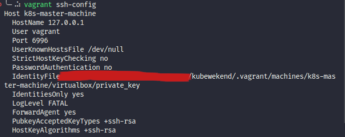
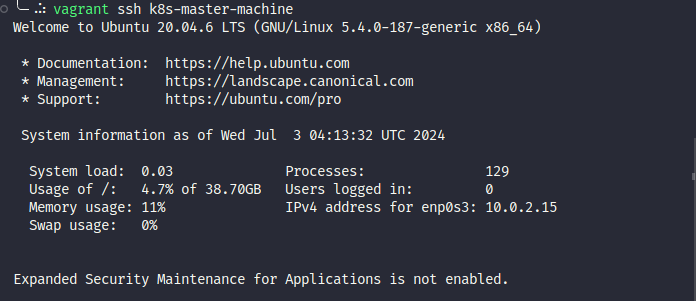
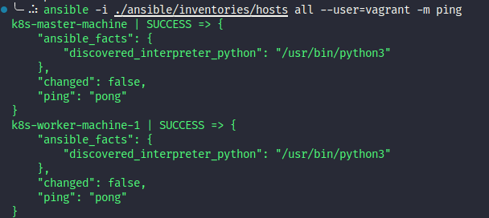
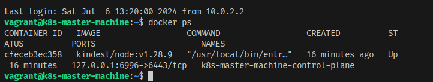
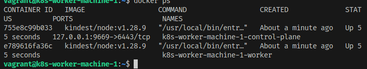
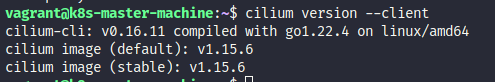
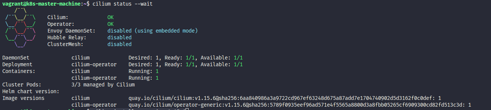
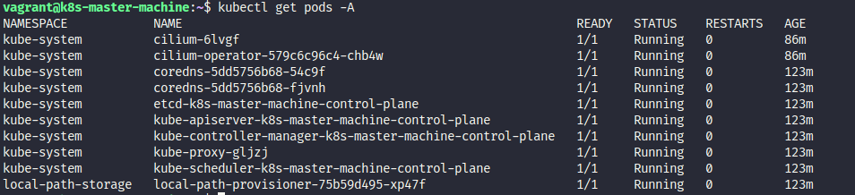
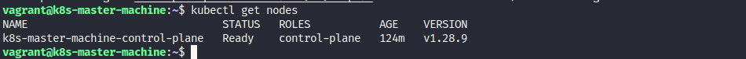

<h1>Setup the fully kubernetes cluster inside the locally hosted</h1>

<h2>Table of Contents</h2>

- [Use `Vargrant` to configuration the VM with provider](#use-vargrant-to-configuration-the-vm-with-provider)
  - [Requirements tools](#requirements-tools)
  - [Step by step](#step-by-step)
  - [`Vargrant` note](#vargrant-note)
- [Ansible - To setup and run script and bring up kubernetes cluster on locally, Use `kind`](#ansible---to-setup-and-run-script-and-bring-up-kubernetes-cluster-on-locally-use-kind)
  - [Define host for ansible provisioning](#define-host-for-ansible-provisioning)
  - [Run ansible for provisioning k8s with kind](#run-ansible-for-provisioning-k8s-with-kind)
  - [Conclusion after provisioning K8s with kind and connfiguration](#conclusion-after-provisioning-k8s-with-kind-and-connfiguration)
- [Exploring, understanding and provisioning require components inside the `kind` cluster](#exploring-understanding-and-provisioning-require-components-inside-the-kind-cluster)
  - [Make the cluster become to ready state](#make-the-cluster-become-to-ready-state)
  - [Learn about `kind` cluster](#learn-about-kind-cluster)
  - [Detailing the important components inside the `kind` cluster](#detailing-the-important-components-inside-the-kind-cluster)
- [`cilium` and `ebpf` - The powerful kernal service of kubewekend cluster](#cilium-and-ebpf---the-powerful-kernal-service-of-kubewekend-cluster)

## Use `Vargrant` to configuration the VM with provider

### Requirements tools

  - Install [virtualbox](https://www.virtualbox.org/wiki/Downloads)
  - Install [vagrant](https://developer.hashicorp.com/vagrant/docs/installation)

### Step by step

1. Location on the root of project
2. Set environment from file `.env` or manually configure

```bash
# Manually
export SSH_USER="vargrant-user"
export SSH_PRIV_KEY_PATH="~/.ssh/vmbox"

# Use .env file
cp -r .env.examples .env
set -o allexport && source .env && set +o allexport
```
3. Up your `vagrant` via `virtualbox` by

```bash
# Use can use another provider: https://developer.hashicorp.com/vagrant/docs/providers
# Provision 1 master and 1 worker
vagrant up k8s-master-machine k8s-worker-machine-1 --provider=virtualbox

# You can provision more worker with regex pattern
vagrant up "/k8s-worker-machine-[2-3]/" --provider=virtualbox
```

<h3>Result provisioning</h3>


### `Vargrant` note

> When you want to destroy, use `destroy` command with option to destroy vm

```bash
# Shutdown and destroy VM for all machines
vagrant destroy --graceful --force

# Specify the target with name
# (Use can regex to manipulate multiple machines)
vagrant destroy k8s-worker-machine-1 --graceful --force
```

> When you want to execute a `shell` script, you can use `provision` command

```bash
# Execute a shell script for all machines
vagrant provision

# Execute a shell script for specific machines
# (Use can regex to manipulate multiple machines)
vagrant provision k8s-worker-machine-1
```

> When you want to turn off the machine provisioning, use `halt` command

```bash
# Turn off all machines provision
vagrant halt

# Turn off the specific machine provision 
# (Use can regex to manipulate multiple machines)
vagrant halt k8s-worker-machine-1
```

> When you want to reload the machine provisioning when update Vargrantfile, use `reload` command

```bash
# Reload all machines provision
vagrant reload

# Reload the specific machine provision
# (Use can regex to manipulate multiple machines)
vagrant reload k8s-worker-machine-1
``` 

> When you want to add a new box to the machine, or cut off time for downloads machine. Use can use `box` command

```bash
# Check actually box we have in host
vagrant box list

# Install box to host
vagrant box add https://location/of/vagrant/box # (Can be local, Vagrant Registry or private storage)

# Example: vagrant box add https://app.vagrantup.com/ubuntu/boxes/focal64
```

When you want to connect to the machine, you have two ways to connect 

- Via `vargrant`, `ssh` command

```bash
# Connect to machine with specified machine name
vagrant ssh k8s-worker-machine-1

# When you want to pass command via ssh
vagrant ssh k8s-worker-machine-1 --command "echo "Hello World" > foo.txt"
```

- Via actions with manually configured `ssh-key`

```bash
# With this action you need to location where .vagrant in your project, usually in root directory
ls .vagrant/

# After that you need run `ssh-agent` to create new session for agent ssh
eval $(ssh-agent -s) # Set the new session agent

# Add the key to your host, and make a authentication
ssh-add ./vagrant/machines/k8s-master-machine/private_key

# And lastone make a connection to machine on custom port
# Befor that you can check again with `vagrant ssh-config` to understand your `ssh` work on port
vagrant ssh-config

# Make a ssh connection
ssh vagrant@127.0.0.1 -p 6996
```

<h3>Show SSH Configuration</h3>



<h3>Make SSH connection</h3>



## Ansible - To setup and run script and bring up kubernetes cluster on locally, Use `kind`

### Define host for ansible provisioning

On this step, you can use script which i create for purpose read and update hosts file for ansible

```bash
# If the file not executable, you can update permission for that
chmod +x ./script/operate-kind-cluster.kind

# Execute the bash script
./script/operate-kind-cluster.sh
```

After that your hosts file will update, like

```yaml
k8s-master-machine ansible_ssh_host=127.0.0.1 ansible_ssh_port=6996 ansible_ssh_user=vagrant
k8s-worker-machine-1 ansible_ssh_host=127.0.0.1 ansible_ssh_port=9669 ansible_ssh_user=vagrant
```

When you doing done with setup hosts, you can use `ansible` to check your connection to host

```bash
ansible -i ./ansible/inventories/hosts all --user=vagrant -m ping
```

<h3>Check ping with Ansible</h3>



### Run ansible for provisioning k8s with kind

Before you doing this step, you need make sure

- Need to configure Ansible to run the project (Ansible runs only on Linux, so need WSL for window machine or Linux virtual machine)
- Ansible is a bunch of tools built from python3. Install python is obligated for setup ansible environment (Recommended: python_version >= 3.9). Installing ansible ansible-lint via command:

```bash
# Python < 3.12
pip3 install ansible ansible-lint

# With Python = 3.12 (That tough to install :>)
# NOTICE: You need follow the strategy of python
# Recommendation: install apt
sudo apt install python3-ansible-runner -y
# Use pipx instead pip3 to install non-debian package
sudo apt install pipx -y
pipx ensurepath
pipx install ansible-lint
```

After you install all things above, just feel free to update or change configuration inside `./ansible/inventories/host_vars` to update configuration on `master` or `worker`, and one more things ansible will use `template` to configuration `kind`, and you can follow that config and know what variable will map to `template` at `./ansible/templates/kind-config.yaml.j2`

When you confirm all, perform command `ansible-playbook` to help you build kind cluster inside machine. Ansible will include two tags

- **install_common**: Install dependencies and install kind tool, to help you setup kind cluster
- **setup_kind**: Set variables base on your host_name, and execution `kind` command to build cluster base on template

```bash
# Setup control-plane (master) machine
ansible-playbook -i ansible/inventories/hosts --extra-vars="host_name=k8s-master-machine" --tags "install_common,setup_kind" ansible/k8s-provisioning-playbook.yaml
# Setup worker machine
ansible-playbook -i ansible/inventories/hosts --extra-vars="host_name=k8s-worker-machine-1" --tags "install_common,setup_kind" ansible/k8s-provisioning-playbook.yaml
```

<h3>Control Plane when completely provisioning</h3>



<h3>Worker when completely provisioning</h3>



### Conclusion after provisioning K8s with kind and connfiguration

> On this session, you will have meet the problem about `kind` need control-plane to operate cluster, It means you need at least one cluster to doing control stuff, not only worker node on host. So that cause some misconfiguration, to prevent fail in `ansible`, so I custom the template except `role` variables, now it will do same provisioning for master and worker, just exist only `control-plane` role

Actually when you install `kubectl` to your host, you will figure out 

>[!Bug]
Right now, you kind cluster be in provisioned, **but your state of cluster will not be ready**, it means because some target is not be ready, include `local-path-provisioner` `core-dns`. And reason why start from we do not install `cni` and it make kubelet cann't be started inside the cluster, 

*That is reason why temporarily I will not share about how can make cluster become HA. And replacing, now we are moving to next part to learn about `etcd`, `cni` and `kubelet`, that can make your cluster become professional and stable*

## Exploring, understanding and provisioning require components inside the `kind` cluster

### Make the cluster become to ready state

> IYKYK, on the previous session 2, we have problem about state of cluster is not `ready`, you can deal with that problem by easily install one of `cni` to the cluster. In this topic, I will learn `cilium` and go to advantage with this tool that reason why i choose `cilium` to default `cni` of the cluster

You can find more information about setup `cilium` at: [Cilium Quick Installation](https://docs.cilium.io/en/stable/gettingstarted/k8s-install-default/)

To operate `cilium`, you need to install `cli` version and get communication with your cluster via that daemon

```bash
# Download cilium
wget https://github.com/cilium/cilium-cli/releases/download/v0.16.11/cilium-linux-amd64.tar.gz

# Extract
tar -xzf cilium-linux-amd64.tar.gz

# Install cilium
sudo mv cilium /usr/local/bin/
```

And now you have `cilium-cli` on your host




You install `cilium` to your cluster

```bash
# Install cilium to your cluster
cilium install --version 1.15.6

# Validate of cilium after installation
cilium status --wait
```



And re-check again your state of node, all pods and node are ready for in-use, before to doing that check make sure you install `kubectl`.

```bash
# Install kubectl from official page
curl -LO "https://dl.k8s.io/release/$(curl -L -s https://dl.k8s.io/release/stable.txt)/bin/linux/amd64/kubectl"

# Change permission for your kubectl tool
chmod +x kubectl

# Install kubectl to your host
sudo mv kubectl /usr/local/bin
```


You can check and validate your state of cluster and pod via `get` command

```bash
kubectl get pods -A
```




```bash
kubectl get nodes
```



Already for all stuff, now we can inspect what we have after running successfully cluster with `kind`

### Learn about `kind` cluster

When you work with Kubernetes this will contain some major features, and you need to understand. Read more at: [Kubernetes Components](https://kubernetes.io/docs/concepts/overview/components/) for English Version and If you want to learn in Vietnamese, shout out to [A. Quan Huynh - Kubernetes Series - Kubernetes internals architecture](https://viblo.asia/p/kubernetes-series-bai-11-kubernetes-internals-architecture-L4x5xPjb5BM)

Belong to `control-plane`
- `kube-apiserver`: *The API server is a component of the Kubernetes control plane that exposes the Kubernetes API.*
- `etcd`: *Consistent and highly-available key value store used as Kubernetes' backing store for all cluster data.*
- `kube-controller`: *Control plane component that runs controller processes.*
- `kube-scheduler`: *Control plane component that watches for newly created Pods with no assigned node, and selects a node for them to run on.*

Belong to `node`
- `kube-proxy`: *kube-proxy is a network proxy that runs on each node in your cluster, implementing part of the Kubernetes Service concept.*
- `kubelet`: *An agent that runs on each node in the cluster. It makes sure that containers are running in a Pod.*
- `Container runtime`: *Easily from previous twice session, kind use `docker` to part of container engine to operate cluster*.

Besides

> With kind, mostly of them is providing

- I have customize additional about networking part with `cilium` (Network Plugins) - *software components that implement the container network interface (CNI) specification*. That is factor and build up your workflow in local node on next session in my series
- `Container Resource Monitoring`: *Container Resource Monitoring records generic time-series metrics about containers in a central database, and provides a UI for browsing that data (Now, I am not setup this, but on the monitoring session)*
- `Cluster-level Logging`: *A cluster-level logging mechanism is responsible for saving container logs to a central log store with search/browsing interface.*
- `DNS`: *Cluster DNS is a DNS server, in addition to the other DNS server(s) in your environment, which serves DNS records for Kubernetes services.*

### Detailing the important components inside the `kind` cluster

1. So first read about `kubelet` configuration inside host, you need to exec inside `kind-control-plane` container

```bash
# Exec to docker control-plane
docker exec -it k8s-master-machine-control-plane /bin/bash

# View kubelet configuration
kubectl get --raw "/api/v1/nodes/k8s-master-machine-control-plane/proxy/configz" | jq
```
and you can view about `kubelet` configuration

2. Secondly, we will move to  `etcd` of kind cluster, that is important factor in kubernetes help you mostly powerful thing

You can find more information about `etcd` in the documentation: https://etcd.io/docs/v3.5/, and figure out what `etcd` bring up to kubernetes at: https://www.armosec.io/glossary/etcd-kubernetes/

- To view about detail `etcd`, use can use `get` command

```bash
kubectl get pods etcd-k8s-master-machine-control-plane -o json
```

And currently on `1.28.9` kubernetes, `etcd` is already running on version `registry.k8s.io/etcd:3.5.12-0`


- You can access to `etcd` shell, and can perform some practice with that use `exec` command

```bash
# Exec to stdin
kubectl exec --tty --stdin pods/etcd-k8s-master-machine-control-plane -- /bin/sh

# Use etcd to check version
etcd --version

# Practice etcd via etcdctl
etcdctl version
```

3. We will move on `kube-scheduler` which give decisions about what node is can deploy your pod, inspect that via `describe` command

```bash
# Inspect about kube-scheduler
kubectl describe pods/kube-scheduler-k8s-master-machine-control-plane
```

As you can see, It will run container in image `registry.k8s.io/kube-scheduler:v1.28.9`, and provide some configuration like

```bash
kube-scheduler
--authentication-kubeconfig=/etc/kubernetes/scheduler.conf
--authorization-kubeconfig=/etc/kubernetes/scheduler.conf
--bind-address=127.0.0.1
--kubeconfig=/etc/kubernetes/scheduler.conf
--leader-elect=true
```

You can explore more about at: [Scheduler Configuration](https://kubernetes.io/docs/reference/scheduling/config/)

Follow the [Linkedin - Demystifying the Kubernetes Scheduler: Assigning Pods to Nodes Behind the Scenes](https://www.linkedin.com/pulse/demystifying-kubernetes-scheduler-assigning-pods-nodes-adamson-y9eie#:~:text=The%20default%20scheduler%20algorithm%20filters,resource%20utilization%2Cspreading%2C%20etc.), and I can understand argorithm mostly use like

> The default scheduler algorithm filters and prioritizes nodes to find optimal match. 

- **Filtering** rules out nodes that don't meet pod requirements like enough resources or match affinity rules.

- **Prioritizing** ranks remaining nodes to pick the best fit based on factors like resource utilization,spreading, etc.

4. Yup the `kube-controller`, kind have it and you can inspect more inside kind cluster use `describe` command, you can explore about this component at: https://komodor.com/learn/controller-manager/

```bash
kubectl describe pods/kube-controller-manager-k8s-master-machine-control-plane
```

I know it just controller base on kubernetes version `registry.k8s.io/kube-controller-manager:v1.28.9` with parameters

```bash
 kube-controller-manager
   --allocate-node-cidrs=true
   --authentication-kubeconfig=/etc/kubernetes/controller-manager.conf
   --authorization-kubeconfig=/etc/kubernetes/controller-manager.conf
   --bind-address=127.0.0.1
   --client-ca-file=/etc/kubernetes/pki/ca.crt
   --cluster-cidr=10.244.0.0/16
   --cluster-name=k8s-master-machine
   --cluster-signing-cert-file=/etc/kubernetes/pki/ca.crt
   --cluster-signing-key-file=/etc/kubernetes/pki/ca.key
   --controllers=*,bootstrapsigner,tokencleaner
   --enable-hostpath-provisioner=true
   --kubeconfig=/etc/kubernetes/controller-manager.conf
   --leader-elect=true
   --requestheader-client-ca-file=/etc/kubernetes/pki/front-proxy-ca.crt
   --root-ca-file=/etc/kubernetes/pki/ca.crt
   --service-account-private-key-file=/etc/kubernetes/pki/sa.key
   --service-cluster-ip-range=10.96.0.0/16
   --use-service-account-credentials=true
```

5. How about `apiserver`, that is important plane for make conversation for all cluster, handle all request and execute when you meet the requirements

More explore about `apiserver` will disscuss details in this session in my blog, but you can feel free to inspect configuration and service use `kubectl`

```bash
# Inspect information about apiserver
kubectl describe pods/kube-apiserver-k8s-master-machine-control-plane
```

Like above, It use same version of kubernetes, `registry.k8s.io/kube-apiserver:v1.28.9`, with configuration

```bash
 kube-apiserver
   --advertise-address=172.18.0.2
   --allow-privileged=true
   --authorization-mode=Node,RBAC
   --client-ca-file=/etc/kubernetes/pki/ca.crt
   --enable-admission-plugins=NodeRestriction
   --enable-bootstrap-token-auth=true
   --etcd-cafile=/etc/kubernetes/pki/etcd/ca.crt
   --etcd-certfile=/etc/kubernetes/pki/apiserver-etcd-client.crt
   --etcd-keyfile=/etc/kubernetes/pki/apiserver-etcd-client.key
   --etcd-servers=https://127.0.0.1:2379
   --kubelet-client-certificate=/etc/kubernetes/pki/apiserver-kubelet-client.crt
   --kubelet-client-key=/etc/kubernetes/pki/apiserver-kubelet-client.key
   --kubelet-preferred-address-types=InternalIP,ExternalIP,Hostname
   --proxy-client-cert-file=/etc/kubernetes/pki/front-proxy-client.crt
   --proxy-client-key-file=/etc/kubernetes/pki/front-proxy-client.key
   --requestheader-allowed-names=front-proxy-client
   --requestheader-client-ca-file=/etc/kubernetes/pki/front-proxy-ca.crt
   --requestheader-extra-headers-prefix=X-Remote-Extra-
   --requestheader-group-headers=X-Remote-Group
   --requestheader-username-headers=X-Remote-User
   --runtime-config=
   --secure-port=6443
   --service-account-issuer=https://kubernetes.default.svc.cluster.local
   --service-account-key-file=/etc/kubernetes/pki/sa.pub
   --service-account-signing-key-file=/etc/kubernetes/pki/sa.key
   --service-cluster-ip-range=10.96.0.0/16
   --tls-cert-file=/etc/kubernetes/pki/apiserver.crt
   --tls-private-key-file=/etc/kubernetes/pki/apiserver.key
```

6. Go to `kube-proxy`, network configuration implementation for kubernetes concept, To inspect that service use `describe` command

```bash
kubectl describe pods/kube-proxy-xxxxx
```

NOTE: `xxxxx` will need you to fill, use `get pods` to retrieve that

After you use `describe` command, you can image the container it use `registry.k8s.io/kube-proxy:v1.28.9` and use configmap to add configuration to kube-proxy

```bash
kubectl get configmap kube-proxy
```

7. Reach to lastly `coredns`, that is `dns` service which offer from `kubernetes`, mostly use for `dns` and `service discovery` purpose

```bash
kubectl describe deployments coredns 
```

As you can see, `coredns` will use configuration from `configmap` to operate and start with image `registry.k8s.io/coredns/coredns:v1.10.1`, that will help your service understand, give dns inside cluster to give route for service can commnuncate with each others

The config is quite new for me, but that kind of clearly to understanding what that want to defination

```bash
  Corefile: |
    .:53 {  Corefile: |
    .:53 {
        errors
        health {
           lameduck 5s
        }
        ready
        kubernetes cluster.local in-addr.arpa ip6.arpa {
           pods insecure
           fallthrough in-addr.arpa ip6.arpa
           ttl 30
        }
        prometheus :9153
        forward . /etc/resolv.conf {
           max_concurrent 1000
        }
        cache 30
        loop
        reload
        loadbalance
    }

        errors
        health {
           lameduck 5s
        }
        ready
        kubernetes cluster.local in-addr.arpa ip6.arpa {
           pods insecure
           fallthrough in-addr.arpa ip6.arpa
           ttl 30
        }
        prometheus :9153
        forward . /etc/resolv.conf {
           max_concurrent 1000
        }
        cache 30
        loop
        reload
        loadbalance
    }
```

And now we go through all the services of the cluster, reach to especially things I have setup, to understand what is that `cilium` service and what we can use it for

## `cilium` and `ebpf` - The powerful kernal service of kubewekend cluster


