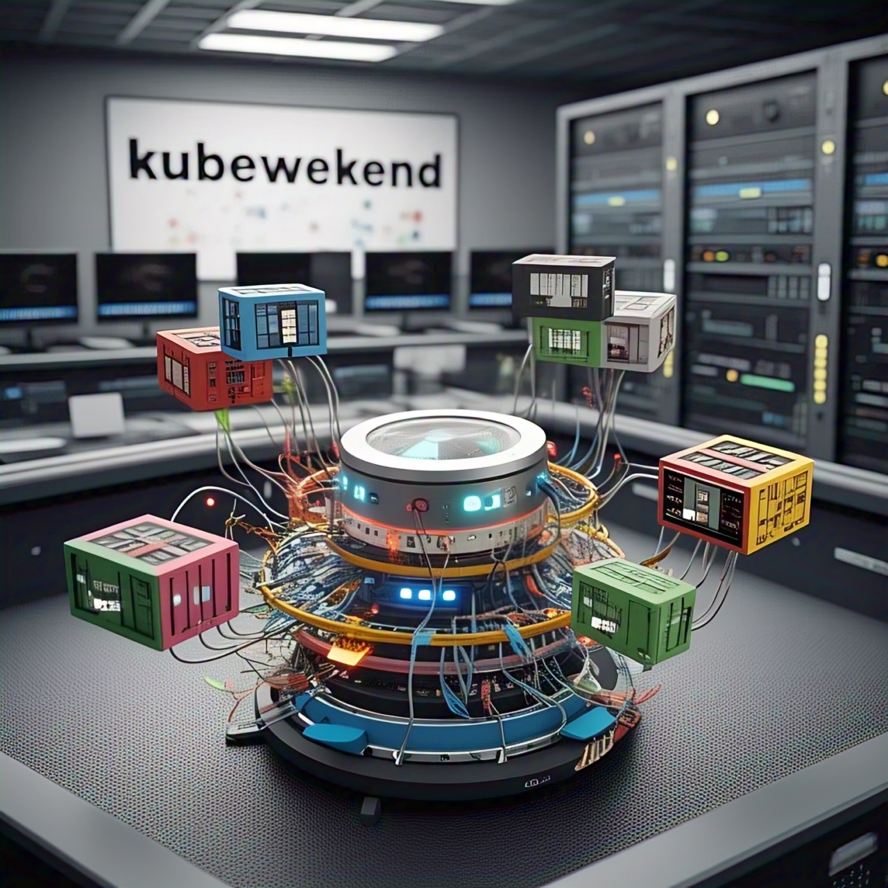

# Kubewekend 👨‍🚀🚀☁️🌕

> [!NOTE]
>
>Learn how to setup the fully kubernetes cluster inside your local environment

<div align="center">
	
</div>

---

<h2>Table of Contents</h2>

- [Kubewekend 👨‍🚀🚀☁️🌕](#kubewekend-️)
  - [Usage](#usage)
    - [Requirements tools](#requirements-tools)
    - [Kubewekend CLI (`setup.sh`)](#kubewekend-cli-setupsh)
    - [Step by step](#step-by-step)
      - [Setup Host with Vagrant](#setup-host-with-vagrant)
      - [Ansible Inventory — `hosts` File](#ansible-inventory--hosts-file)
      - [Setup K8s Cluster and Utilities Features](#setup-k8s-cluster-and-utilities-features)
    - [LGTM Stack — Continuous Monitoring, Logging \& Profiling Example](#lgtm-stack--continuous-monitoring-logging--profiling-example)
    - [Helm Chart](#helm-chart)
    - [Troubleshoot](#troubleshoot)
  - [Kubewekend Major Session 🚄🚄🚄](#kubewekend-major-session-)
    - [Kubewekend Session 1: Use `Vargrant` to configuration the VM with provider](#kubewekend-session-1-use-vargrant-to-configuration-the-vm-with-provider)
    - [Kubewekend Session 2: Ansible - To setup and run script and bring up kubernetes cluster on locally, Use `kind`](#kubewekend-session-2-ansible---to-setup-and-run-script-and-bring-up-kubernetes-cluster-on-locally-use-kind)
    - [Kubewekend Session 3: Exploring, understanding and provisioning require components inside the `kind` cluster](#kubewekend-session-3-exploring-understanding-and-provisioning-require-components-inside-the-kind-cluster)
    - [Kubewekend Session 4: `cilium` and `ebpf` - The powerful kernal service of kubewekend cluster](#kubewekend-session-4-cilium-and-ebpf---the-powerful-kernal-service-of-kubewekend-cluster)
    - [Kubewekend Session 5: Build and Operate High Availability (HA) `Kubewekend` Cluster](#kubewekend-session-5-build-and-operate-high-availability-ha-kubewekend-cluster)
    - [Kubewekend Session 6: CSI and Ceph with Kubewekend](#kubewekend-session-6-csi-and-ceph-with-kubewekend)
    - [Kubewekend Session 7: Setup new deployment and route traffic to kubewekend cluster](#kubewekend-session-7-setup-new-deployment-and-route-traffic-to-kubewekend-cluster)
    - [Kubewekend Session 8: Setting Up the Cluster Monitoring Stack with LGTM and Grafana Alloy](#kubewekend-session-8-setting-up-the-cluster-monitoring-stack-with-lgtm-and-grafana-alloy)
  - [Kubewekend Extra Session 🚢🚢🚢](#kubewekend-extra-session-)
    - [Kubewekend Session Extra 1: Longhorn and the story about NFS in Kubernetes](#kubewekend-session-extra-1-longhorn-and-the-story-about-nfs-in-kubernetes)
    - [Kubewekend Session Extra 2: Rebuild Cluster with RKE2 or K3S](#kubewekend-session-extra-2-rebuild-cluster-with-rke2-or-k3s)
    - [Kubewekend Session Extra 3: RKE2 and The Nightmare with Network and CoreDNS](#kubewekend-session-extra-3-rke2-and-the-nightmare-with-network-and-coredns)
    - [Kubewekend Session Extra 4: Kind and Sandbox environment for GitLab CI](#kubewekend-session-extra-4-kind-and-sandbox-environment-for-gitlab-ci)

## Usage

> [!NOTE]
>
> Supported K8s Distribution with Kubewekend

| Kubewekend Cluster Distribution        | Local | VM  | VPS Remote |
| -------------------------------------- | ----- | --- | ---------- |
| Kind (K8s in Docker)                   | ✅     | ✅   | ✅          |
| K3s Standalone                         | ✅     | ✅   | ✅          |
| K3s High Availability (HA)             | 🚧    | ✅   | ✅          |
| RKE2                                   | 🚧    | 🚧  | 🚧         |

### Requirements tools

| Tool | Required | Purpose |
|------|----------|---------|
| [VirtualBox](https://www.virtualbox.org/wiki/Downloads) | Yes\* | VM provider |
| [Vagrant](https://developer.hashicorp.com/vagrant/docs/installation) | Yes\* | VM provisioning |
| [Ansible](https://docs.ansible.com/ansible/latest/installation_guide/intro_installation.html) | Yes | Cluster orchestration |
| [kubectl](https://kubernetes.io/docs/tasks/tools/) | Yes | Kubernetes CLI |
| [Helm](https://helm.sh/docs/intro/install/) | Yes | Chart management |
| [Docker](https://docs.docker.com/engine/install/) | Optional | Required for Kind clusters |
| [kind](https://kind.sigs.k8s.io/docs/user/quick-start#installation) | Optional | Kind binary (also installed by playbook) |

> \* Vagrant + VirtualBox are required only for local VM workflows. For remote VPS targets, only Ansible + SSH are needed.

### Kubewekend CLI (`setup.sh`)

> [!TIP]
>
> All cluster operations are unified under a single CLI. Run it from the project root — no need to invoke `ansible-playbook` or `vagrant` directly.

```bash
# Show all available commands
./scripts/setup.sh help

# Check prerequisites
./scripts/setup.sh env check

# Show subcommand help
./scripts/setup.sh <command> help
```

| Command | Purpose |
|---------|----------|
| `env` | Check tools, initialise `.env` |
| `vagrant` | VM lifecycle — up, halt, destroy, ssh |
| `inventory` | Generate/inspect Ansible inventory, set remote VPS |
| `kind` | Kind cluster — setup, destroy, utilities |
| `k3s` | K3s cluster — standalone, HA, destroy, utilities |
| `network` | VirtualBox NAT forwarding (hook-up / return) |
| `config` | View / edit `master.yaml` and `worker.yaml` |
| `status` | Project-wide status dashboard |
| `quickstart` | Guided end-to-end workflows |

See [scripts/README.md](./scripts/README.md) for the full CLI reference.

---

### Step by step

#### Setup Host with Vagrant

> [!NOTE]
>
> Read more at [Kubewekend Session 1: Build up your host with Vagrant](https://wiki.xeusnguyen.xyz/Tech-Second-Brain/Personal/Kubewekend/Kubewekend-Session-1)

1. Position yourself at the project root.
2. Bring up your VMs with the CLI:

```bash
# Provision only the master node
./scripts/setup.sh vagrant up k8s-master-machine

# Provision master + one worker (K3s standalone / Kind)
./scripts/setup.sh vagrant up k8s-master-machine k8s-worker-machine-1

# Provision master + multiple workers (K3s HA)
./scripts/setup.sh vagrant up k8s-master-machine k8s-worker-machine-1 k8s-worker-machine-2
```

> [!NOTE]
>
> You can also use `vagrant` directly with `--provider=virtualbox`. The CLI wraps it for convenience and ensures you stay in the project root.

#### Ansible Inventory — `hosts` File

> [!IMPORTANT]
>
> The inventory file at [`ansible/inventories/hosts`](./ansible/inventories/hosts) is split into **two sections**. Make sure the right section is populated before running a playbook.

| Section | Group | Used by |
|---------|-------|---------|
| **SECTION 1**: Standalone | `standalone-masters`, `standalone-workers` | `kind-playbook.yaml`, `k3s-playbook.yaml` |
| **SECTION 2**: HA | `ha_master_init`, `ha_master_join`, `ha_worker` | `k3s-ha-playbook.yaml` |

Generate the inventory automatically from running Vagrant VMs:

```bash
./scripts/setup.sh inventory generate

# Or ping all known hosts to verify connectivity
./scripts/setup.sh inventory ping

# For a remote (non-Vagrant) VPS target
./scripts/setup.sh inventory set-remote
```

#### Setup K8s Cluster and Utilities Features

> [!NOTE]
>
> After the upgrade 12/2025 and 01/2026, Ansible Playbooks are already rebuilt for multiple concepts which allow you configure a lots of stuff
> with your Kind or K3s cluster to test and experiment K8s features
>
> For more information, you can see what are implementing via table below

**Kind** (`kind-playbook.yaml`)

|                            Name of Task                            | Description                                                                                                                                       | Tags              | State |
| :----------------------------------------------------------------: | ------------------------------------------------------------------------------------------------------------------------------------------------- | ----------------- | ----- |
|                  Install Common Kubewekend Tools                   | Install common libraries, kind and dependencies for your host                                                                                     | install_common    | ✅     |
|                         Setup Kind Cluster                         | Create Kind Cluster with mounting kind-config template to ansible host                                                                            | setup_kind        | ✅     |
|                      Setup Kind Network (CNI)                      | Setup network for Kind Cluster when `disableDefaultCNI: true` (Options: Calico, Flannel, Cilium)                                                  | setup_kind        | ✅     |
|                Setup Load Balancer for Kind cluster                | Setup Load Balancer for external `LoadBalancer`-type services (Options: metallb, cloud-provider-kind, cilium-ipam-lb)                             | setup_kind        | ✅     |
|             Setup Ingress Controller for Kind cluster              | Setup Ingress Controller (Options: NGINX, Traefik, Cilium, Kong)                                                                                  | setup_kind        | ✅     |
|                 Setup GatewayAPI for Kind cluster                  | Setup Gateway API (Options: Kong, Cilium, Traefik)                                                                                                | setup_kind        | ✅     |
| Setup Network Forwarding for port 80/443 from host to Kind cluster | Forward host ports 80/443 into Kind cluster via socat                                                                                             | setup_kind        | ✅     |
|                        Remove Kind cluster                         | Remove the Kind cluster and related components                                                                                                    | remove_kind       | ✅     |

**K3s** (`k3s-playbook.yaml` · `k3s-ha-playbook.yaml`)

|                            Name of Task                            | Description                                                                                                       | Tags                         | State |
| :----------------------------------------------------------------: | ----------------------------------------------------------------------------------------------------------------- | ---------------------------- | ----- |
|               Install Common K3s Node Packages                     | Install common libraries and dependencies on the target node                                                      | install_common               | ✅     |
|             Setup K3s Standalone (master or worker)                | Deploy K3s server (master) or agent (worker) — one node at a time via `--host`                                    | setup_k3s                    | ✅     |
|             Setup K3s High Availability (HA) Cluster               | Bootstrap etcd init node, join additional control-plane nodes, and attach agents                                  | setup_k3s                    | ✅     |
|                  Configure CNI (Flannel / Calico / Cilium)                  | Apply CNI manifests post-install based on `k3sCluster.cni.type`                                                   | setup_k3s                    | ✅     |
|             Setup Load Balancer (ServiceLB / MetalLB)               | Deploy load balancer and configure IP pool from `k3sCluster.loadBalancer`                                         | setup_k3s                    | ✅     |
|              Setup Ingress + Dashboard + Support API Gateway (Only Traefik)           | Deploy ingress controller and optional dashboard from `k3sCluster.ingress`                                        | setup_k3s                    | ✅     |
|                       Remove K3s node                              | Uninstall K3s from a target node (server or agent)                                                                | remove_k3s                   | ✅     |

**Utilities** (`k8s-utilities-playbook.yaml`)

|                            Name of Task                            | Description                                                                                                                                  | Tags              | State |
| :----------------------------------------------------------------: | -------------------------------------------------------------------------------------------------------------------------------------------- | ----------------- | ----- |
|            Ingress test deployment inside the cluster              | Deploy a sample workload to validate Ingress routing                                                                                         | ingress_test      | ✅     |
|          API Gateway test deployment inside the cluster            | Deploy a sample workload to validate API Gateway routing                                                                                     | apigateway_test   | ✅     |
|                 Setup cert-manager for the cluster                 | Install cert-manager for TLS certificate management                                                                                          | certmanager       | ✅     |
|                  Setup Dashboard for the cluster                   | Install a Kubernetes dashboard (type configured in `utilities`: `kubernetes-dashboard`, `headlamp`, `rancher`)                               | dashboard         | ✅     |
|                  Setup Storage for the cluster                     | Install Longhorn distributed block storage with optional iSCSI and NFS support                                                               | storage           | ✅     |
|              Setup Secret Management for the cluster               | Install Vault or OpenBao with optional auto-unseal, Vault Operator, and unseal key persistence                                               | secret_management | ✅     |
|                Setup K8s Extensions for the cluster                | Install Reflector, Reloader, and External Secrets Operator                                                                                   | k8s_extensions    | ✅     |
|                    Setup GitOps for the cluster                    | Install ArgoCD (with Image Updater + Extensions) or Flux (with Weave GitOps UI) and optional Kargo promotion engine                          | gitops            | ✅     |
|                 Setup Security for the cluster                     | Install policy engine (Kyverno or OPA Gatekeeper) and identity provider (Dex) for OIDC/OAuth2 authentication                                | security          | ✅     |
|          Setup Internal Developer Portal (IDP) for the cluster     | Install Backstage developer portal for application catalogue and self-service workflows                                                       | idp               | ✅     |
|               Setup Monitoring for the cluster                     | Install the full LGTM observability stack: kube-prometheus-stack (Prometheus + Grafana), Alloy APM collector, Loki, Tempo, and Pyroscope     | monitoring        | ✅     |
|               Setup Service Mesh for the cluster                   | Install Istio service mesh for advanced traffic management, mTLS, and observability                                                           | service_mesh      | ✅     |

> [!IMPORTANT]
>
> Before running any playbook, review and adjust the cluster configuration file at [`ansible/inventories/host_vars/master.yaml`](./ansible/inventories/host_vars/master.yaml).
> Use the CLI to inspect it without opening a text editor:
>
> ```bash
> # Interactive table summary
> ./scripts/setup.sh config show
>
> # Full raw YAML
> ./scripts/setup.sh config show --raw
>
> # Open in $EDITOR
> ./scripts/setup.sh config edit
> ```

**Kind cluster** (all-in-one):

```bash
# Install common tools + create cluster
./scripts/setup.sh kind setup

# Add utilities after the cluster is up
./scripts/setup.sh kind utils certmanager ingress_test dashboard

# Tear down
./scripts/setup.sh kind destroy
```

**K3s standalone** (separate master / worker calls):

```bash
# Master first
./scripts/setup.sh k3s setup --host k8s-master-machine

# Then each worker
./scripts/setup.sh k3s setup --host k8s-worker-machine-1

# Add utilities
./scripts/setup.sh k3s utils certmanager gitops

# Tear down
./scripts/setup.sh k3s destroy
```

**K3s HA cluster** (HA section in `hosts` must be populated):

```bash
# Enable HA in master.yaml first
./scripts/setup.sh config edit

# Bootstrap all HA nodes at once
./scripts/setup.sh k3s ha-setup
```

> [!TIP]
>
> Prefer the `--dry-run` flag to preview the exact `ansible-playbook` command that will be executed before committing:
> ```bash
> ./scripts/setup.sh k3s setup --host k8s-master-machine --dry-run
> ```

### LGTM Stack — Continuous Monitoring, Logging & Profiling Example

> [!NOTE]
>
> The [`examples/lgtm-testing/`](./examples/lgtm-testing/) directory contains a full-stack demo application designed to showcase and stress-test the **LGTM observability stack** (Loki · Grafana · Tempo · Prometheus) combined with **Pyroscope** for continuous profiling. It is the recommended starting point for validating your monitoring setup after running the `monitoring` utility tag.

**Architecture**

| Component | Role |
|-----------|------|
| **Frontend** — Nginx + HTML dashboard | Trigger test scenarios via UI |
| **Backend** — FastAPI + OpenTelemetry SDK | Generates traces, structured logs, and custom metrics |
| **PostgreSQL** | Persistence layer — produces DB span attributes |
| **Pyroscope agent** | Continuous CPU/memory flamegraph profiling |
| **Alloy** | DaemonSet collector — receives OTLP gRPC from app, routes to Tempo / Loki / Prometheus |
| **Grafana** | Unified dashboard — correlate Traces ↔ Logs ↔ Profiles |

**Option 1 — Docker Compose (local, no cluster required)**

```bash
cd examples/lgtm-testing
docker compose up -d --build
open http://localhost:3000   # frontend dashboard
open http://localhost:8000/docs  # FastAPI Swagger UI
```

**Option 2 — Deploy into a running Kubernetes cluster**

```bash
# Build and push images (or use a local registry for kind)
docker build -t lgtm-testing-backend:latest ./examples/lgtm-testing/backend
docker build -t lgtm-testing-frontend:latest ./examples/lgtm-testing/frontend

# Apply manifests
kubectl apply -f examples/lgtm-testing/k8s/namespace.yaml
kubectl apply -f examples/lgtm-testing/k8s/postgres.yaml
kubectl apply -f examples/lgtm-testing/k8s/backend.yaml
kubectl apply -f examples/lgtm-testing/k8s/frontend.yaml

# Wait for readiness
kubectl -n lgtm-testing wait --for=condition=ready pod \
  -l app.kubernetes.io/part-of=lgtm-testing --timeout=120s
```

**Test scenarios included**

| Scenario | Endpoint | What to verify in Grafana |
|----------|----------|--------------------------|
| Normal CRUD (traces) | `GET/POST /api/todos/` | Tempo: clean span waterfall; Loki: logs with `trace_id` |
| Auth failures | `POST /api/auth/login` with bad creds | Tempo: red error spans; Prometheus: `auth_attempts_total` |
| N+1 slow report | `GET /api/bottleneck/slow-report` | Tempo: many small DB spans; Loki: `duration_ms` warnings |
| CPU-intensive profiling | `GET /api/bottleneck/cpu-intensive` | Pyroscope: `hashlib.sha256` + `_fibonacci` hotspots in flamegraph |

**Seed test data**

```bash
curl -X POST http://localhost:8000/api/seed/
```

> [!TIP]
>
> Before deploying on Kubernetes, make sure the `monitoring` utility is already set up so Grafana, Loki, Tempo, and Pyroscope are available to receive telemetry data:
> ```bash
> ./scripts/setup.sh kind utils monitoring
> # or
> ./scripts/setup.sh k3s utils monitoring
> ```

See [`examples/lgtm-testing/README.md`](./examples/lgtm-testing/README.md) for the full architecture diagram, custom metric reference, and Grafana exploration guide.

---

### Helm Chart

For install **helm-charts** from `kubewekend`, you can use **command** 

```bash
helm repo add kubewekend https://kubewekend.xeusnguyen.xyz
```

### Troubleshoot

1. [Error when setup virtualbox in Ubuntu](https://wiki.xeusnguyen.xyz/Tech-Second-Brain/Operation-System/Linux/Awesome-Linux-Troubleshoot#error-when-setup-virtualbox-in-ubuntu)
2. [VMSetError: VirtualBox can’t enable the AMD-V extension](https://wiki.xeusnguyen.xyz/Tech-Second-Brain/Operation-System/Linux/Awesome-Linux-Troubleshoot#vmseterror-virtualbox-cant-enable-the-amd-v-extension)
3. Specific `Vagrantfile`

> [!IMPORTANT]
> 
> In repositories will be defined some `Vagrantfile` for two type K8s for base and ceph, for specific the Vagrantfile you should specific them via environment variables. Explore more at: [StackOverFlow - Specify Vagrantfile path explicity, if not plugin](https://stackoverflow.com/questions/17308629/specify-vagrantfile-path-explicity-if-not-plugin)

   ```bash
   # Run as usual for base version (Default: Vagrantfile)
   vagrant up name-of-your-machine

   # Run specific Vagrantfile for CEPH version (Example: Vagrantfile.ceph)
   VAGRANT_VAGRANTFILE=Vagrantfile.ceph vagrant up name-of-your-machine
   ```

## Kubewekend Major Session 🚄🚄🚄

### Kubewekend Session 1: Use `Vargrant` to configuration the VM with provider

> [!NOTE]
> 
> This lab is take the topic around play and practice with `vagrant` - the software can help you provide the virtual machine in your host. First step way to setup `kubernetes` cluster inside your machine, and play with on next session

Read full article about session at [Kubewekend Session 1: Build up your host with Vagrant](https://wiki.xeusnguyen.xyz/Tech-Second-Brain/Personal/Kubewekend/Kubewekend-Session-1)

### Kubewekend Session 2: Ansible - To setup and run script and bring up kubernetes cluster on locally, Use `kind`

> [!NOTE]
> 
> This lab is practice with ansible the configuration for setup `kind` cluster inside machine on the previous session

Read full article about session at [Kubewekend Session 2: Setup Kind cluster with Ansible](https://wiki.xeusnguyen.xyz/Tech-Second-Brain/Personal/Kubewekend/Kubewekend-Session-2)

### Kubewekend Session 3: Exploring, understanding and provisioning require components inside the `kind` cluster

> [!NOTE]
> 
> This session talk about basically architecture and learn more fundamental components inside kubernetes, and what the structure of them inside clusters

Read full article about session at [Kubewekend Session 3: Basically about Kubernetes architecture](https://wiki.xeusnguyen.xyz/Tech-Second-Brain/Personal/Kubewekend/Kubewekend-Session-3)

### Kubewekend Session 4: `cilium` and `ebpf` - The powerful kernal service of kubewekend cluster

> [!NOTE]
> 
> This session will talk and learn about eBPF and the especially representation of eBPF are cilium and hubble to become main CNI of Kubewekend and talk about Observability of them

Read full article about session at [Kubewekend Session 4: Learn about ebpf with hubble and cilium](https://wiki.xeusnguyen.xyz/Tech-Second-Brain/Personal/Kubewekend/Kubewekend-Session-4)

### Kubewekend Session 5: Build and Operate High Availability (HA) `Kubewekend` Cluster

> [!NOTE]
> 
> This session is really pleasant when we talk about how can create HA cluster with `kubewekend`, learn more the components inside `kubernetes` and try figure out about `network`, `security`, `configuration`, `container runtime` and `system` via this session

Read full article about session at [Kubewekend Session 5: Build HA Cluster](https://wiki.xeusnguyen.xyz/Tech-Second-Brain/Personal/Kubewekend/Kubewekend-Session-5)

### Kubewekend Session 6: CSI and Ceph with Kubewekend

> [!NOTE]
> 
> This session is covered about topic storage inside `Kubernetes` cluster, how can they work with `CSI` Architecture and why we need to `CSI Driver` for handle this stuff. Furthermore, I try to practice with `Ceph` - one of popular storage opensource for `Kubewekend` cluster

Read full article about session at [Kubewekend 6: CSI and Ceph with Kubewekend](https://wiki.xeusnguyen.xyz/Tech-Second-Brain/Personal/Kubewekend/Kubewekend-Session-6)


### Kubewekend Session 7: Setup new deployment and route traffic to kubewekend cluster

> [!NOTE]
>
> This session explores core networking concepts in Kubernetes, guiding you through the setup of new deployments and demonstrating how to expose services for external access using Ingress and the Gateway API. We also delve into External LoadBalancer concepts and the operational nuances of managing them via Cilium NodeIPAM. By the end of this session, you will understand how to bridge the gap between cluster-internal services and external clients using modern, eBPF-powered networking strategies.

### Kubewekend Session 8: Setting Up the Cluster Monitoring Stack with LGTM and Grafana Alloy

> [!NOTE]
>
> This session provides the opportunity to deploy the LGTM stack, the comprehensive observability suite from the Grafana ecosystem. You will gain hands-on experience in correlating logs, metrics, traces, and profiling data to achieve deep-level observability within a Kubernetes environment.

## Kubewekend Extra Session 🚢🚢🚢

### Kubewekend Session Extra 1: Longhorn and the story about NFS in Kubernetes

> [!NOTE]
> 
> This lab is try to take you to journey to learn about new CSI for Kubernetes, `Longhorn` and deliver you to new method to handle transfer large file via network by NFS protocol. I also provide more information about `iSCSI`, `nfs-ganesha` and technique `rdma`

Read full article about session at [Kubewekend Session Extra 1: Longhorn and the story about NFS in Kubernetes](https://wiki.xeusnguyen.xyz/Tech-Second-Brain/Personal/Kubewekend/Kubewekend-Session-Extra-1)


### Kubewekend Session Extra 2: Rebuild Cluster with RKE2 or K3S

> [!NOTE]
> 
> This article aims to provide you with insights into alternatives for self-hosting a full Kubernetes cluster. Both K3s and RKE2 are strong contenders worth considering to guide your decision. Focusing on the self-hosted approach with RKE2, I want to share more about my experiences working with it over the past four months.

Read full article about session at [Kubewekend Session Extra 2: Rebuild Cluster with RKE2 or K3S](https://wiki.xeusnguyen.xyz/Tech-Second-Brain/Personal/Kubewekend/Kubewekend-Session-Extra-2)


### Kubewekend Session Extra 3: RKE2 and The Nightmare with Network and CoreDNS

> [!NOTE]
>
> This article is my story about wrestling with networking in Kubernetes. I'll cover the frustrating problems that arise when your pods can't communicate with services, CoreDNS fails to resolve domains, and the tough issues involving **CNI** and the **ChecksumTX** of network interfaces in Kubernetes.

Read full article about session at [Kubewekend Session Extra 3: RKE2 and The Nightmare with Network and CoreDNS](https://wiki.xeusnguyen.xyz/Tech-Second-Brain/Personal/Kubewekend/Kubewekend-Session-Extra-3)


### Kubewekend Session Extra 4: Kind and Sandbox environment for GitLab CI

> [!NOTE]
>
> This article shares my experience setting up a sandbox environment with Kind to adapt new Kubernetes environments within CI/CD pipelines. I'll provide several ideas for running both CPU and GPU applications, demonstrating their behavior specifically within GitLab CI.

Read full article about session at [Kubewekend Session Extra 4: Kind and Sandbox environment for GitLab CI](https://wiki.xeusnguyen.xyz/Tech-Second-Brain/Personal/Kubewekend/Kubewekend-Session-Extra-4)